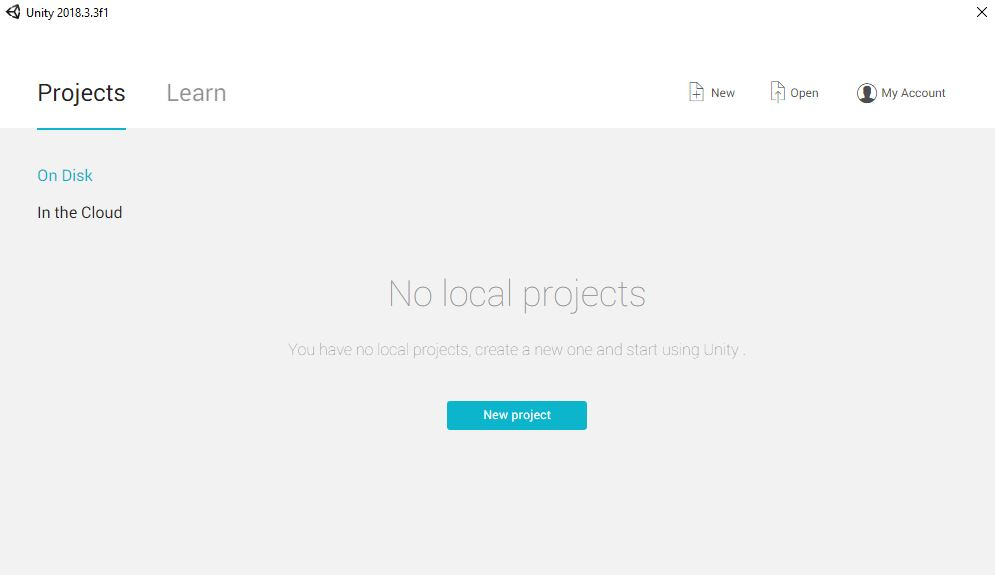
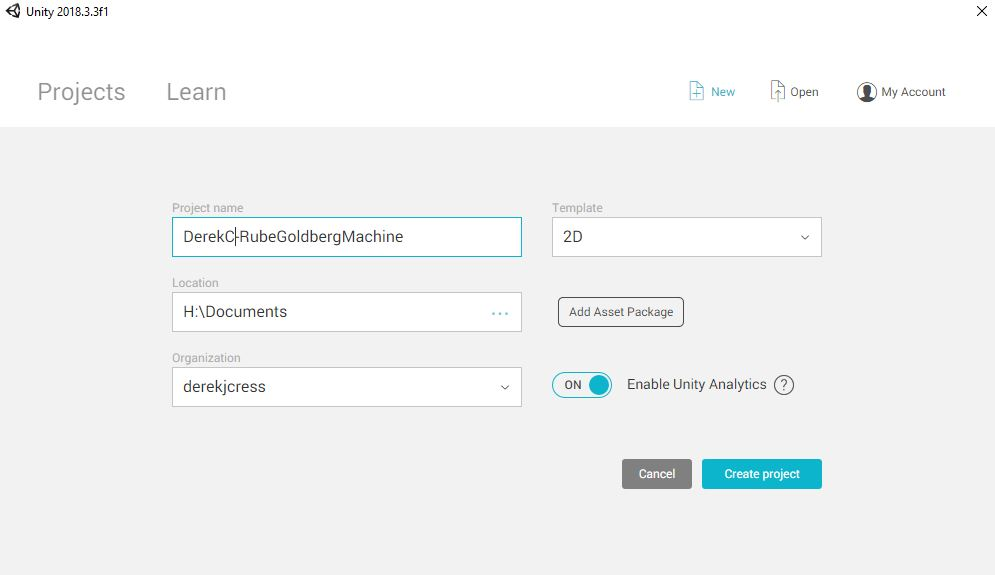
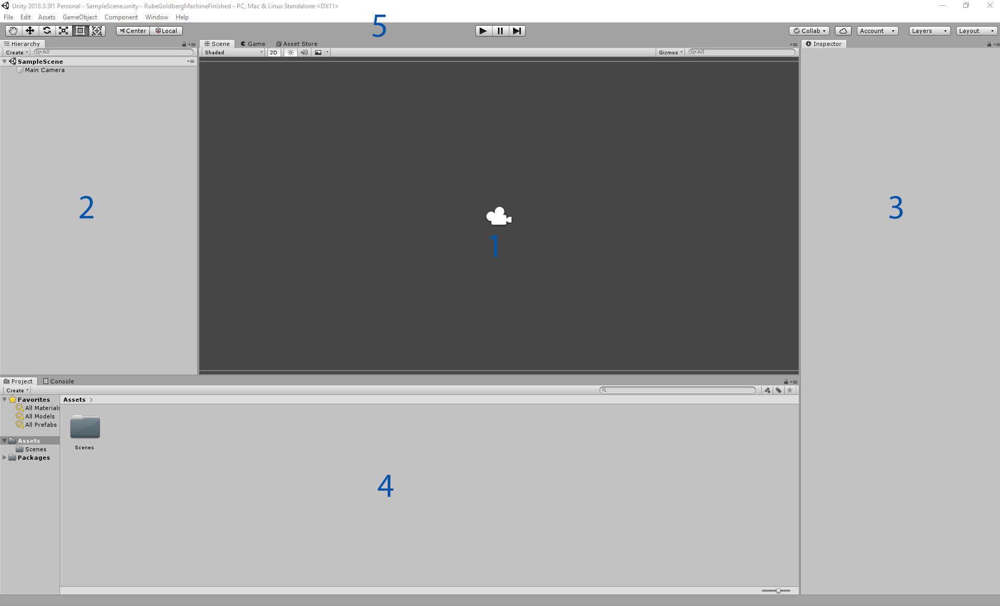

# Rube Goldberg Machine

This is explaining the layout of Unitys' Launcher and Editor layout.

## The Launcher

If you haven't downloaded Unity visit [their website](https://store.unity.com/download) to download it.\
Before we can dive right into making a game we need to get a project set up in Unity.

  

Go ahead and click the ["New project"](https://docs.unity3d.com/Manual/GettingStarted.html) button in the middle.\
*Note : If you are using Unity Hub click "NEW" in the top right.*

  

* Give your project a name! (If you are are using this in a class make sure to include YOUR name in the name).  
* Then make sure to set "Template" to ["2D"](https://docs.unity3d.com/Manual/2Dor3D.html).
* And finally choose the location. You probably want to have one main folder to hold all of the projects in these lessons.
*Don't worry about the bottom bit about organizations or analytics. If they have default settings just leave them alone.*
   
Now press "Create project" and let it load.  

## The Editor

Now lets point out some of the main features and important parts of the Unity Editor. Don't worry if you don't know what a term means, everything will be explained.

  

1. This is the "Scene View". Here you will be able to navigate your ["Scene"](https://docs.unity3d.com/Manual/CreatingScenes.html) and build your levels. It's also where you will see your game when you play it.
1. This is the ["Hierarchy"](https://docs.unity3d.com/Manual/Hierarchy.html). All of the "Objects" in your scene view will be listed here.
1. This is the ["Inspector"](https://docs.unity3d.com/Manual/UsingTheInspector.html). When you click on an object in the hierarchy or scene view the details will come up here. It's basically a list of settings for what ever you selected.
1. This is the current ["Project"](https://docs.unity3d.com/Manual/ProjectView.html). All of the files you will use or make for your game will be stored here. 
1. Along the top we have a few things.
	* On the left there is the ["Tool bar"](https://docs.unity3d.com/Manual/Toolbar.html). These let you move, rotate, and scale objects. We'll talk more about these in the future.
	* In the middle we have the "Play Button". These three buttons let you play and play the game.
	* On the right we have a few settings. 
		* The first three have to do with projects involving multiple people. We will leave these alone for now.
		* Next we have the "Layers". Layers let us have objects only interact with certain layers.
		* The last is the ["Layout"](https://docs.unity3d.com/Manual/CustomizingYourWorkspace.html) this changes where the different windows are positioned in Unity. Feel free to change this to something you like better. If you do change this you might have a tougher time following along. Make sure you know which window is which!

## Saving

Unity saves things as ["Scenes"](https://docs.unity3d.com/Manual/CreatingScenes.html). This can be thought of more or less as a level in your game. When you make a new Unity project it creates a "SampleScene" for you, We are going to use our own though.\
Press "Ctrl + S" or click on "Save" under "File" in the top left corner. This should bring up your File Explorer. There will be a file there named "Scenes", double click this, change the name of your file to something like "MyScene", and hit save.\
This will create a new Scene with our Object saved in it.\
Make sure you save your project frequently!

Now that we understand the layout of Unity and the editor we can start making a basic game!\
Refer back to this if you forget which part is which. From now on we will be refering to each part of Unity by name and not position.