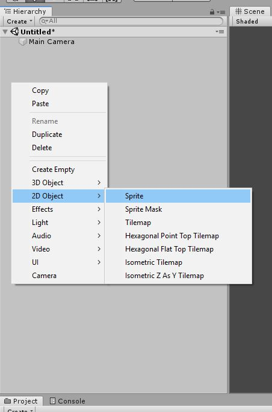
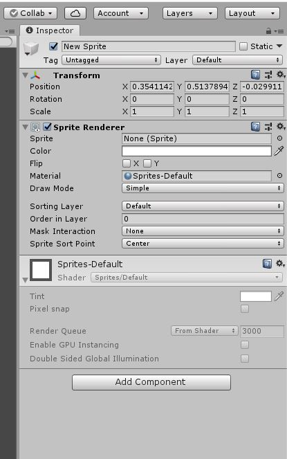
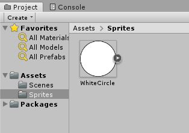
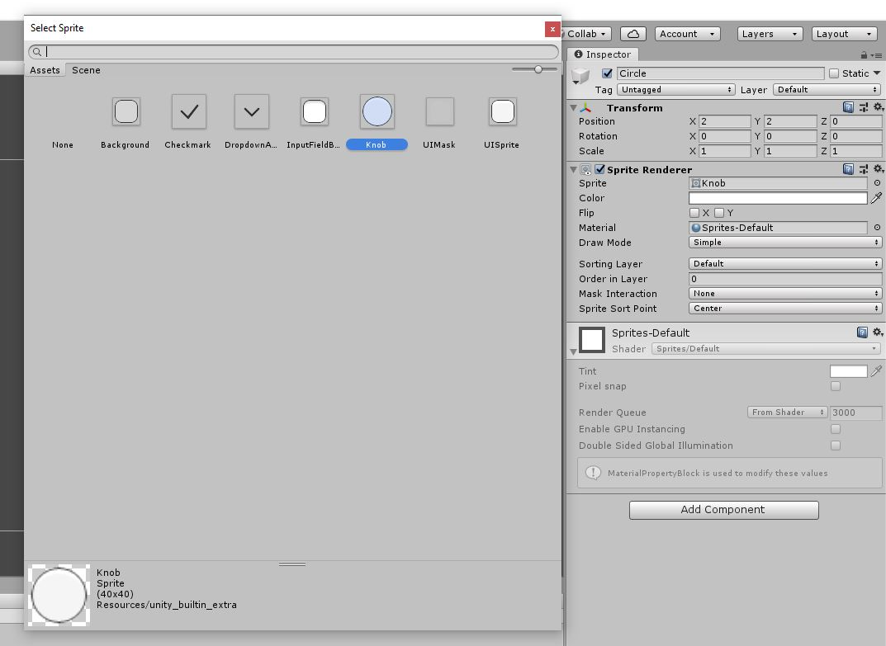
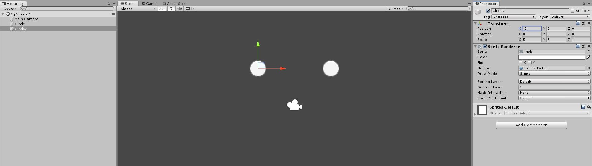
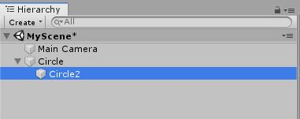
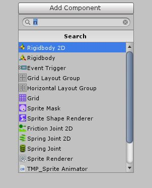
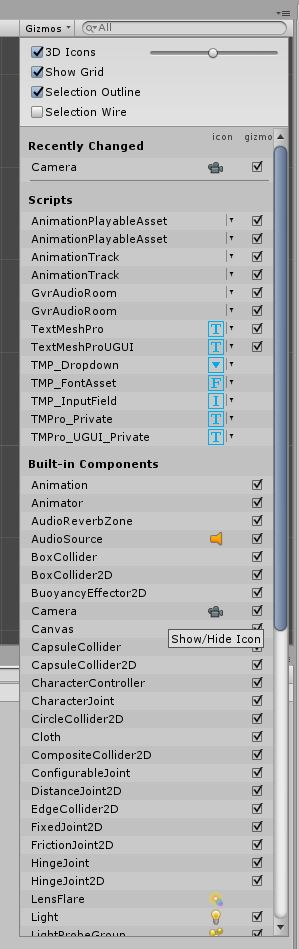

# Rube Goldberg Machine

This is explaining the concept and implementation of "Game Objects" in Unity.

## Game Objects

A [Game Object}(https://docs.unity3d.com/Manual/GameObjects.html) is really anything you put into your game. Everytime you see a character, camera, or piece of the land it is a Game Object. Game Objects hold a list of "Components" that act as it's settings and behaviours. 

### Creating A Game Object

Let's put a Game Object into our Scene.

Move your mouse over the Hierarchy on the left of your screen, right click, hover over "2D Game Object", and finally Click "Sprite".\
You will now see that there is a "New Sprite" object underneath the "Main Camera".\
Right click this and select "Rename" and give it a name like "Circle". We need to keep our objects named well otherwise it becomes very confusing to fix issues when there are tons of objects.\
We cannot yet see this Object in the Scene. Let's fix this quick.\
Click on the "New Sprite" object and look at the "Inspector" on the right side of the screen.

What we need to do to make our object visible is :

1. We need to move the object so that it is not in the center of the scene and being blocked by the "Main Camera" Object. We do this by changing the ["Transform"](https://docs.unity3d.com/Manual/class-Transform.html) of the Object.
	* In the top section "Transform" find the set of three numbers beside "Position" and set these to "2", "2", and "0" respectively (You can also see this in the photo below).
	* (You can also select the "Move Tool" in the top left of Unity and drag the green and red handles that appear).

1. Next we need to give this object a ["Sprite"](https://docs.unity3d.com/Manual/Sprites.html) or picture to actually appear as when we look at it. We do this by giving the "Sprite Renderer" a "Sprite".

	* First we need to import a Sprite into Unity.
		* Right click on the Project section of Unity (bottom bar), hover over "Create" and click on "Folder". Name the folder "Sprites". Remember, organization is key!
		* Go to the Assets folder in this project and drag "WhiteCircle" into the folder you just made.

	

	* On the right side on the screen under the Inspector find the "Sprite Renderer".
	* The top setting here should be "Sprite", look to right at the bar that says "None (Sprite)". Just at the right edge there is a small circle. Click this.
	* A menu like the one shown above will appear. These are all of the Sprites in your project. Choose the one we imported before, "WhiteCircle".

	

Our circle shoud be now be clearly visible in our Scene.

*A Note*
* You can use the various "Gizmos" in the top left corner to manipulate your objects. Try clicking on any of them ("Move", "Rotate", "Scale") and use the arrows / lines that appear with in the Scene View to change the respective parameter on the object.

### Hierarchies

Here we're going to go onto a tangent to learn about hierarchies. These are a way to attach an object to another object. This way we can manipulate the "Parent" object and affect the "Child".\
Hierarchies can be very complex and very usefull but for now we will just be showing the idea behind a hierarchy.\
Start By duplicating the "Circle" we created earlier. Rename the new Object to keep everything organized. Then change it's Position to "-2", "2", "0" respectively.\
This should something like this.

We are now going to ["Parent"](https://docs.unity3d.com/Manual/Hierarchy.html) our second Circle to the first. We can do this by clicking and dragging the "Circle2" over the "Circle" under the Hierarchy window in Unity.

You will now notice that the second circle Object is indented below the first. You will also see an arrow beside the first ones' name that can be used to toggle the view of its Children.\
Now I'd like you to try moving the first Circle around the Scene. Notice how the second one moves. Its position is based on the the first ones position.\
Let's go over what we have here : 
* A "Parent" is any Object with Children. The Parent acts as the base for it's Children.
* A "Child" is any Object with a Parent. The Child will inherit properties from it's Parents. In our case, it's position.
* You can have multiple levels in your Hierarchy. As in a Child itself can have a child.

Feel free to take a some time right now to just play around with what we have. Try rotating your circles, or scaling them differently. You could even add more Objects. Just have some fun and get a feel for this.

### Components

Now we are going to talk about [components](https://docs.unity3d.com/Manual/UsingComponents.html).\
Components allow us to add more functionality to our Objects. Our circle already has a few components on it, "Transform", and "Sprite Renderer". Both of these add something to the object. "Transform" lets the Object have a position in our scene and the "Sprite Renderer" lets the Object display a sprite.\
There are tons of built in Components in Unity and later on we will make our own.\
Let's add a "Rigidbody" Component to our Circle. This Component will add the functionality of being affected by physics, like gravity.\
Select your Circle and click "Add Component" in the Inspector. Start typing "Rigidbody" and when the option pops up choose "Rigidbody 2D" (2D is very important here as our project is going to be 2D).

For simplicity sake I will "Detach" the second Circle from our First. To do this click and drag the "Circle2" in the Hierarchy and move it off of "Circle". You can tell it is not a parent because the name will no longer be indented below "Circle".\
Go ahead and press Play now. This will show us the "Game View" or what is actually happening when someone were to play our game.\
The Rigidbody we added to the circle makes it affected by gravity and falls off the screen. We will talk more about the Rigidbody in the next lesson.

As you can see Components let us have functionality wrapped into a nice clean package. It also allows use to reuse and have better control when making changes.

### Gizmos

In Unity, [Gizmos](https://docs.unity3d.com/Manual/GizmosMenu.html) are little things added to the Scene View to make it easier to manipulate objects. They can be made by the user but in this course it will just be the defualt ones.\
Two of the most notable examples of Gizmos are the grid shown in the Scene View and the colored arrows shown when using the Move Tool.\
Back to the Camera. In the Scene View we can see the Camera Icon in the middle of the view. This is going to be in our way so let's get rid of it. We do not want to lose the Camera though, just the Gizmo.\
To do this click on "Gizmos" at the top right of the screen view. This will give us a dropdown menu. Scroll down and find the Camera and click on the icon listed to disable it.

If you'd like to enable it, do the same thing. We are leaving it off for now though.\
Later on you may find other Gizmos getting in your way. Try searching them up in the dropdown menu to disable/enable them by which component is making the Gizmo.

*Important Side Note*\
While we are talking about the [Camera](https://docs.unity3d.com/Manual/class-Camera.html) we just need to add this note.\
During this project, the Rube Goldberg Machine, you may notice you cannot fit all of your Scene into the Camera. If this happens there is a simple solution we will use for the time being.\
Simply click on your Camera and make the "Size" attribute larger. This will make the Camera's Viewing Volume. Really just how much of the scene it can see at once.\
Later on we will create some better options for our camera but for this project there would be a few too many complications.\
Checkout [this](https://docs.unity3d.com/Manual/class-Camera.html) for a some help.

Now that we understand the idea behind Components we are going to use them to them to play with physics and explore the basics behind our Rube Goldberg Machine.