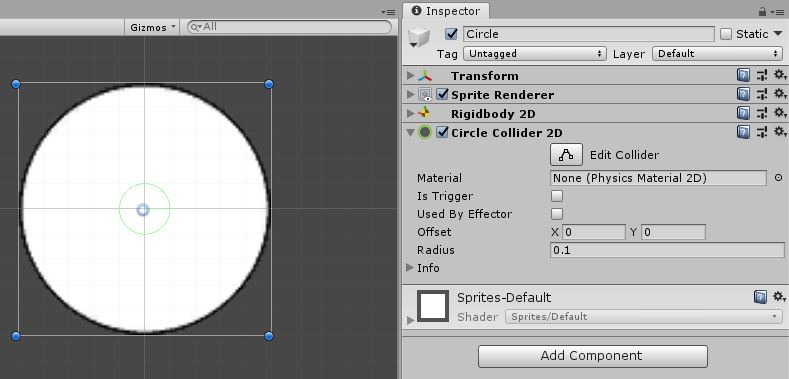
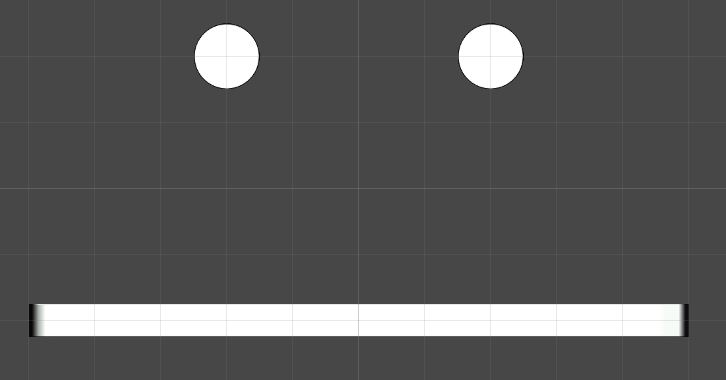
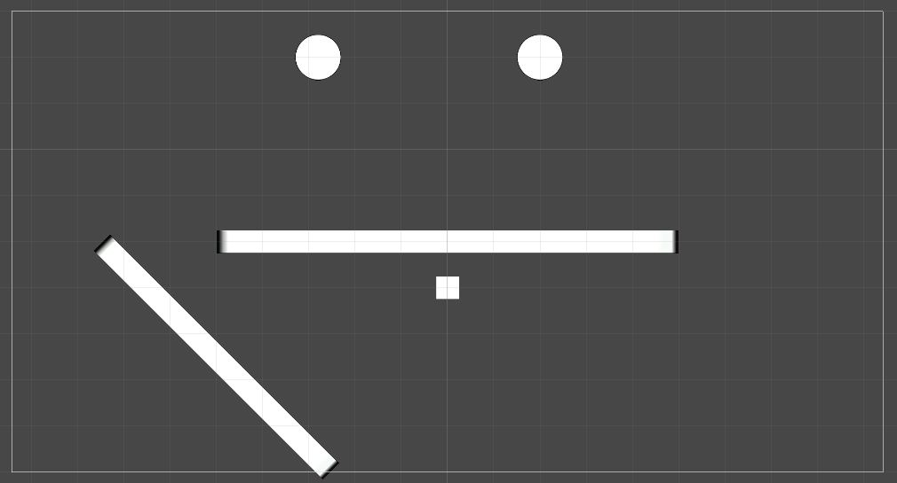

# Rube Goldberg Machine

Here we will talk more about the Rigidbody and Physics in Unity.

## Rigidbody

In the last lesson we added a Rigidbody to our circle and saw it fall. Let's talk a bit more about how this Rigidbody works.\
The basic idea behind the Rigidbody is that it gives an object a physical presence in the world. Just like how you have mass and therefore are affected by gravity. If you didn't have mass you wouldn't be affected by gravity.\
There are many other things the Rigidbody, such as apply drag to objects, but we are just using the basics of the component for this project.

## Collisions

Collisions are one of the most important part of making your game work so let's get some going.\
First thing we are going to do is disable the Camera "Gizmo" so we can better see our scene.

### Colliders

In order for our objects to collide we need to give a Collider. This allows an object to collide or hit other collider Objects.\
Colliders are added to an Object the exact same way as Rigidbody. This is because a Collider is yet another Component.\
Click on our first Circle Object and click add component and begin typing "Collider" until "Circle Collider 2D" shows up. Click on it.

	

*Note, keen eyes might've noticed my Inspector looks different. I've simply collapsed the components to reduce visual clutter. Click the grey arrow in the top left corner of the component.*	

You will now see there is a green circle within your circle. This is what the Collider considers its edge.\
Since this green circle is too small we need to change the size of the it. You can click on the "Edit Collider" button and drag the green squares to change it or in this case set the Radius to "0.5".\
You can tell if the collider is the right size by simply seeing if the size of the green circle is close to the size of the white circle.
In order for us to see the Collider in action we need something else to collide with. 

* Add a new Sprite to your scene.
* Give it a name like "Ground". 
* Set it's position to "0, -2, 0".
* Set it's Scale to "10, 0.5, 1".
* Add the "WhiteBox" file from the Assets folder to the Sprites folder in the Project.
* Set the Sprite to the "WhiteBox" sprite.
* Add a "Rigidbody 2D" to it.
* Add a "Box Collider 2D". This should be the proper size, but you can change it if not.

It should look like this :

Now run your game!\
Oh hold on, that was kinda lame. The box fell too. What good is ground if it falls?\
Let's fix this quick. We just need to change the boxs Rigidbody "Body Type" from "Dynamic" to "Static".\
The "Body Type" tells Unity how to compute the physics of the Object. In our case Dynamic means the Object is affected by physics and Static means the Object is present in the "Physics Space" but not changed by interactions.

Let's run the game again.\
Ok still kinda lame, but we're getting better!\
Let's try one more thing.

* Click on your box and duplicate it.
* Rename it to something like "Anchor".
* Set the Y Position to "-3".
* Finally set the first Boxs' (The big one on top) Body Type back to Dynamic.

Now run it!\
We're cooking with gas now!\
There's just a few more things we're going to do to make this a bit more interesting.\
I encourage you to try setting up the world on your own now. Based on the picture below try and do this yourself. Don't worry about exact values, just see if you can make something similar.

If you can't get this setup just click below for the cheat sheet. But do try it on your own first!

	
Scene Setup Help

	 

* Add a Circle Collider 2D and Rigidbody to the second circle. Just like on the first one.
* Shift the second circle a little to the left.
* Create a second Box with a Rigidbody set to Static and a box collider.
* Set that boxs Position to "-5, -4.5", the Rotations Z to "-45" and the Scale to "7, 0.5, 1".

These numbers don't need to be exact and you can change around the Scene to your liking. Feel free to play around with this. You will be able to understand this better if you do this yourself.

## Physics

Unity has a built in physics engine to make all of your game objects behave realistically. Rigidbodies and Colliders are key parts of the physics in Unity but don't strictly need to be affected by the physics.\
We're now going to talk about how you can change the way physics behave by using Physics Materials and Zones.

### Physics Materials
