# Rube Goldberg Machine

The last section we are going to talk about are Sprites. You might've noticed that we've already been using these in the form of our "WhiteCircle" and "WhiteBox", which is correct. There's a lot more to Sprites than this, more than we could cover now.\
For now, we will just go over putting your own sprites into the game using them in a few ways.

## Sprites

You might be wondering why we've called our images "Sprites". Sprite is simply the common name used for a 2D Graphic used in a game.\
The origin of the name is that Sprite is another word for a ghost. In our game the Sprites float on top of our background like they are ghosts.\
Just an interesting fact for you.

### Importing Sprites

Before we can use a sprite we need to actually put it into our game. We're going to do the same thing we did with the "WhiteBox" and "WhiteCircle" but this time I'm going to let you choose the Sprite.

For this let's get three different Sprites.\
We are going to need :
* A background.
* A ground / box.
* And a circular object.

To find these you can simply google "Video game sprites ______" and insert what you want. Sometimes you might need to play with the wording lots to find the right one or a few that work well together.\
You will likely need these to be PNG files otherwise they might look very odd or cut off parts of the game.\
If you are an artist, don't worry. There will be better opportunities later to make your own Sprites.\
Here are the ones I found :

  
   
  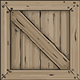

After you have these three sprites go ahead and import them into Unity as we did in the [Game Objects Lesson](/2%20GameObjects.md). Refer back to that if you need a refresher.\
Once you've got those in the file we are going to use them in place of the circle and box we've been using.\
After that your game should be looking a little more custom like so :

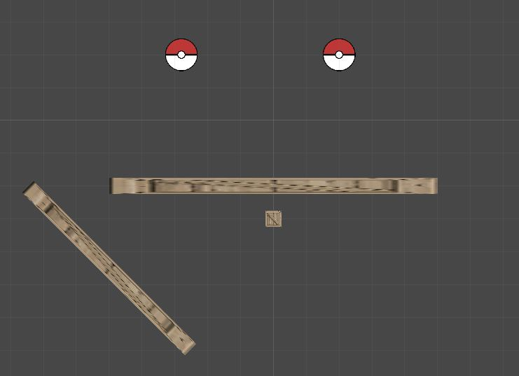

Parts of mine look okay but the ramps look very stretched. It's likely your sprites look bigger or smaller than they should also.\
This would be mainly cause by the size of image. The grid shown in Unitys Scene is 100 by 100 pixels. If your image is larger or smaller than this it will appear distorted.\
An easy way to fix this is to scale the image to 100 by 100 in photoshop or we can do it within Unity.\
If you want to use the built in features this is how :

* Click on your Sprite, the one in the folders, not the Hierarchy. Then click on "Pixels Per Unit" in the Inspector.
* Set the value of this to the same as your images size (Works best if the image is square).

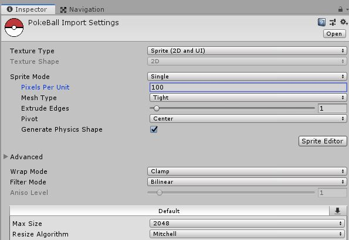

You can play with that value until it works if needed. Don't worry we can always make things work, it just might mean later on you'll need to pay more attention to something like the size of your Colliders.\
In the future when working with Sprites made by you or an artist it is a good idea to follow one scale for all. Meaning if two sprites are supposed to be the same size make them the same pixel size.

Now that we've got that working we will still need to fix the ramps as they are very stretched.\
Again there are a few ways to do this. We can Tile sprites or use 9-Slicing.\
I will demonstrate both and it is up to you to decide which is best in your senacario.

### Tiling

Tiling sprites means that our sprites repeat rather than stretch when it reaches it's max size. Like a repeating pattern of bricks.

The first thing we need to do is set our sprite to be a tiled sprite. Click on the Object you'd like to edit and find its "Sprite Renderer" in the Inspector.\
Find the "Draw Mode" property and set it to "Tiled".

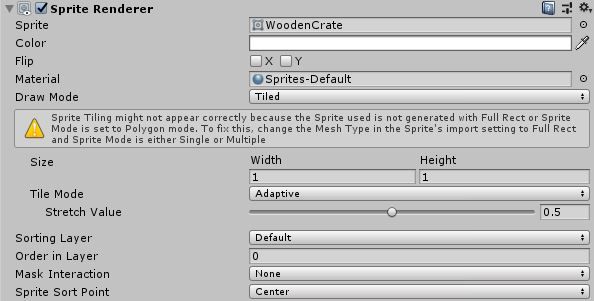

This will bring up an expanded menu below.\
Right now I'd like you to stop for a minute and simply play with the new "Width" and "Height" values. You can also use the "Rect Tool" in the top left of the screen and drag the blue balls that appear around the Object.\
As you may notice the values of this "Width" and "Height" denote how big a sprite should be before it tiles.\
It is important to note that these values are based on the Scale values in the Transform of an object.\
Typically in Unity it is a good idea to leave the scale at "1, 1, 1" when possible simply because this makes them easier to work with in the future.

For now I will do this with a scale of "1, 1, 1". This means we'll need to manually adjust the size of the box collider and sprite.

* Start by setting our scale back to "1, 1, 1".
* Then on the "Sprite Renderer" set the "Width" to "10" and the "Height" to "0.5". 

	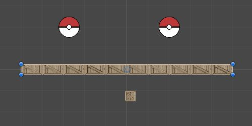

*Note this does squish our sprite vertically. For me it looks ok but if yours does not set it to something that does. If you do just be careful while working with the colliders size.*

*Also note, this might cause the sprite to be cutoff, simply change "Tile Mode" to "Adaptive". This is just below the "Width" and "Height" settings.*

Now go to the "Box Collider 2D".

* Click the "Edit Collider" button. This is just to see the size of the collider easier.
* You can drag the green squares that apear in the scene view if you'd like but I will use the "Size" settings to be percise.
* On the "Size" Property set the values of "X", and "Y" to "10", and "0.5" respectively.

	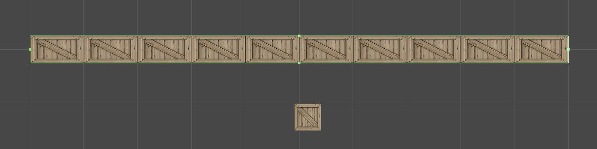

Make sure those values work for the size of your sprite. Check this by seeing if the green outline of the Collider matches the sprite.

If you run the game you should see it works just as before but now it looks nicer.\
Now let's try out the other technique and see which is better for your sprites.

### 9-Slicing

9-Slicing is the process of dividing a Sprite into 9 slices or parts. Each part scales differently. Some only scale horizontally or vertically, some in both, and some don't scale at all.

To start let's slice our sprite.

* Find the sprite you'd like to slice in the Sprites folder.
* Click on this sprite and find the "Sprite Editor" Button.

	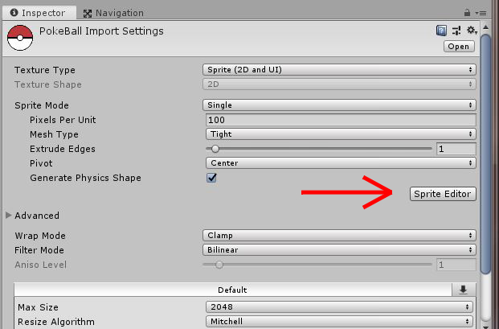

Let's stop here and explain 9-Slicing a little more.

As mentioned before we split the sprite into 9 parts. This is clearly shown in the image above.\
You could more or less think of this as defining the perimeter of the sprite. Each section is scaled differently.

* Sections 1, 3, 7, and 9 are not scaled at all. The corners will stay the same.
* Sections 2 and 8 are only scaled horizontally.
* Sections 4 and 6 are only scaled vertically.
* And section 5 is scaled in both directions.

This technique works very well for sprites that have a distinct outline and a middle that is not distinct.\
It's up to you to determine where to slice your sprite. Let's head back to Unity and do just that.

To slice the Sprite in the Sprite Editor drag the green boxes around the edge to where they should be. You will need to decide where a good place to place these are.\
For me it looks like this :

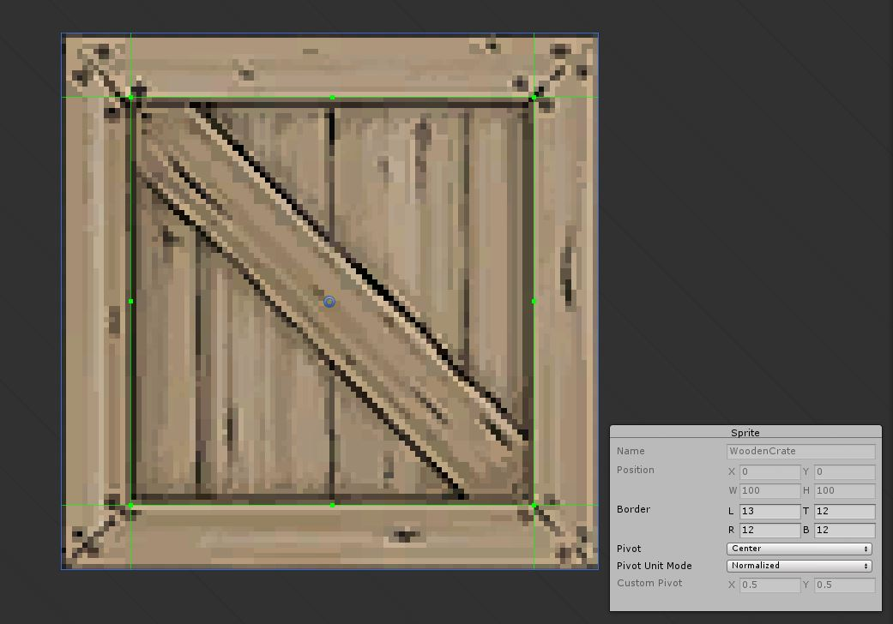

Close that window and hit "Apply" when you are happy.

* Now click on one of your ramps. Same as above I'm going to set the scale back to "1" in all directions.
* Set the "Draw Mode" of the "Sprite Renderer" to "Sliced".
* Then on the "Sprite Renderer" set the "Width" to "10" and the "Height" to "0.5".

Now the sprite is the same size as before but depending on the sprite used it might still look bad. In my case this is true and it is easier to see the effects of slicing at a smaller width.

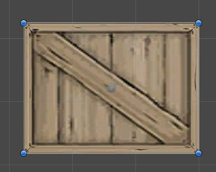

As seen here the corners and edges look normal while the middle has been stretched.

I will be setting both of my ramps to Tiled for the next bit as it looks better than Slicing. If this is not true for you, please use the best fit method.

*Remember*
Doesn't matter with technique you use you will still need to manually set the Colliders size if you reset the scale.\
You'll also need to do this for each other Object you change in this way.

*Note*
If you go back to tiling and notice your sprites look a little different this is because of the slicing.\
To fix open the Sprite in the "Sprite Editor" and reset the green lines back to the edges. Or all four values of "Border" (in the grey box that appears in the editor) to 0.

### Backgrounds With Sprites

Now let's get the background in here. We are just going to do a simple but effective way to make this.\
Start by making a new Sprite, like we've done before, and name it "Background." Then set the Sprite to the sprite you've chosen for your background.\
Don't worry about the size of the background for now, we will fix that later. For now just move the background so it's in the center of the rest of your objects.

To ensure that our other sprites are never hidden behind the background set the "Z" value of your backgrounds "Positon" to any number greater than "0". I'll do "5".\
You likely won't think much has changed. This is because I haven't told you the full truth yet.\
Are you ready? Ok...

**Our game is actually still 3D!**

In the top left of your screen click the button that says "2D"

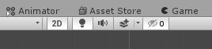

Now hold the right mouse button and use WASD and QE to move around.\
As you can see our game is still fully rendered and computed in 3D space.\
When we made this project and selected "2D" Unity just changes some default settings to make the game seem 2D even though it isn't.

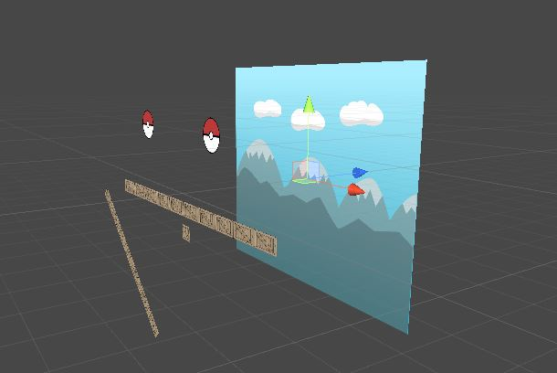

The biggest difference between 3D projects and 2D is that in 2D we don't typically move an object along the Z axis. Though it still exists.\
When we moved the background farther into the Z axis we are making sure unity always renders it behind anything else. But because our camera is Isometric everything appears to be at the same depth.\
Don't worry if that sounds to technical to understand. Just know :

* All our objects that interact with each other should be at the same Z level.
* Our background should have a higher value than anything infront of it.

Switch back to 2D using the button up top.

Now to resize our background we can just change the Scale values because we won't have to worry about Colliders or Rigidbodies with this.\
Make it just a little bit bigger than the Cameras size. You can see the cameras size just by clicking it in the Hierarchy.

Once the size is good just run the game and appreciate how beautiful you've made it.

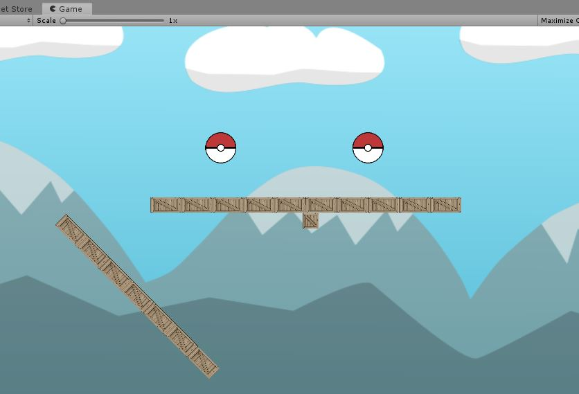

Now we should know everything we need to to carry onto the project for this unit!
