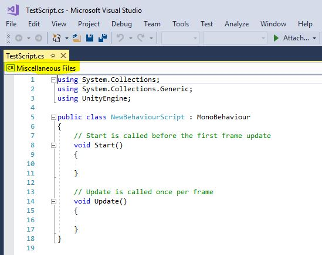
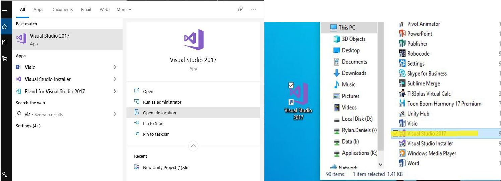
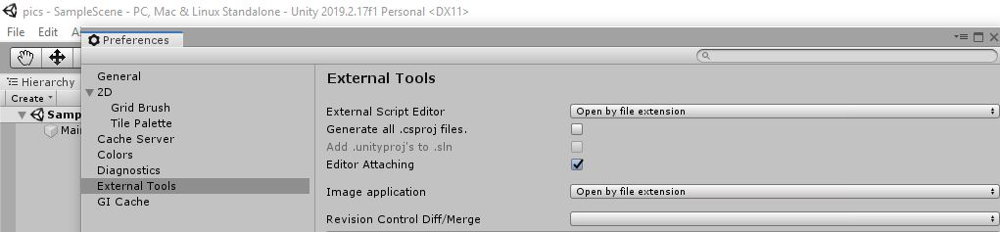

# Dice Game

Here we are going to figure out what a Script is and how Unity uses them.

## Scripts

["Scripts"](https://docs.unity3d.com/Manual/ScriptingSection.html) are what we call our code. Our scripts are simply written files that follow specific rules and can be interpreted by our computer.\
Scripts in Unity are treated as other Components like a Rigidbody. You can attach them to any Object, and they are written using the Language of C#.

[C#](https://docs.microsoft.com/en-us/dotnet/csharp/) is a programming language made by Microsoft and is an Object-Oriented language.\
We will get more into what this means later.

There is a lot to code, but a good way to start is to simply jump into it. Don't worry if not everything makes sense the first time around.\
Just make sure to try everything and the best advice we can give is to play around with it. **Try** and do something unique. Worst that will happen is you can try again.

### Adding Scripts In Unity

Start by making a new Unity project. Make the project 2D, though for this project that doesn't really matter.

As stated before, Scripts are just another type of component. Let's start by making a new Folder in our Assets and call it "Scripts".\
Go into that folder and right click, create, and click ["C# Script"](https://docs.unity3d.com/Manual/CreatingAndUsingScripts.html). Give this script a name like "TestScript". 


Open that up. Throughout these tutorials, we are making this project with Windows and the default Code Editor with Unity, [Visual Studio](https://visualstudio.microsoft.com/).\
If you are on a different system this may be different. No worries it's all the same you just might need to search for a button a little more.\
The script should look like this :

```csharp
using UnityEngine;
using System.Collections;

public class TestScript : MonoBehaviour {

	// Use this for initialization
	void Start() {
	
	}
	
	// Update is called once per frame
	void Update() {
	
	}
}
```

What you see here and on your screen is the default script generated by Unity.\
Lets dissect this a bit.

#### Comments

The very first thing to mention are [comments](https://www.c-sharpcorner.com/UploadFile/puranindia/comments-in-C-Sharp/). The lines that start with `//` are "commented out".\
This means that the computer will not read the line. You can put whatever you want here.\
A very common use for comments are adding notes to your code so that others can quickly understand what your code does.\
They can also be written :

```csharp
// The Computer will not know this exists!

/*
	This is commented out.
	And so is this.
	And on...
*/
```

#### Using

Right at the top we see `using UnityEngine;` and `using System.Collections;`. These ["Import"](https://docs.microsoft.com/en-us/dotnet/csharp/language-reference/keywords/using-directive) code to our script so that we can attach our script to the game or use code written by others. There's a little more to it than that, but we can get to that later.\
Typically don't remove these two unless you know you don't need them. Later we will be adding more of them. Either way, don't worry about these right now.

#### Classes

Just below that we have `public class TestScript : MonoBehaviour` which creates a [class](https://docs.microsoft.com/en-us/dotnet/csharp/tour-of-csharp/classes-and-objects).\
Classes allow us to create multiple objects with all the same features. Quite similar to the Game Objects we've been using.\
An example to think of is a car. A car has wheels, an engine, and a steering wheel but each car can have different wheels, engines, and steering wheels.\
Instead of saying what a car is a bunch of times we can simply make `class Car` that contains things like the type of engine, the color, the ability to speed up.\
Then whenever you want to make a new car you can use this predefined `class` to speed up that process.\
Classes are blueprints that can build on each other. In this case `TestScript` inherits from ["MonoBehaviour"](https://docs.unity3d.com/ScriptReference/MonoBehaviour.html), denoted by the `:`, which is a class created by Unity.\
Here we can use all the functionality that was made in `MonoBehaviour` in a new way.\
Topics like Classes can be extremely confusing at first. Don't worry if this sounds real funky, it'll become second nature soon.

#### Functions

Then we have `void Start()` and `void Update()`. These are [functions](https://docs.microsoft.com/en-us/dotnet/csharp/programming-guide/classes-and-structs/methods) (in some situations functions are called ["methods"](https://docs.microsoft.com/en-us/dotnet/csharp/programming-guide/classes-and-structs/methods) but they are the same for our case). Functions allow us to write code once then call it lots of times throughout your code.\
The two functions written here are from the `MonoBehaviour` class we talked about above.\
`void` is the [type](https://docs.microsoft.com/en-us/dotnet/csharp/programming-guide/types/) of data the function gives back to us, in this case [nothing](https://docs.microsoft.com/en-us/dotnet/csharp/language-reference/keywords/void).

That's quite a bit of info to take in. That might not have all made a bunch of sense but that's ok. There is a good bit to code and especially to start with. It's typically easier once we start writing code to understand these things.\
We also have a file of reference material with links to videos and tutorials that go a lot more into the explanation if you need that.\
Let's write some code!

### Important Note For Visual Studios

If you are using [Visual Studios (VS)](https://visualstudio.microsoft.com/) for your code you may have a big problem. Worry not, we can fix it.\
What might be happening is that VS has not recognized you are working in a Unity project. An easy way to tell if this is happening is to see if your file is labeled "Miscellaneous Files" near the top left of the editor window.



If this is the case, close VS. Then go to Unity. In the top left click on the menu option "Assets" then go down to "Open C# Project".\
This will open a folder and let you choose the file to open. There should be a "sln" file from VS. Click that and you should be good to go.

#### No .sln File?

When you use "Open C# Project" you may be presented with no .sln file, meaning Unity did not create one when you created your project.\
Lucky for us, this is not too hard to fix. In the Windows search bar on the bottom left of your screen type in "Visual Studio" and find the option to "Open File Location".\
From here, drag this shortcut onto your Desktop to copy it there.



Now in Unity, click on Edit and from the dropdown menu select Preferences.\ Click on External Tools, the first option on this page will be to set up a script editor with Unity.



Click on the box beside "External Script Editor" and select Browse. From here find and select the shortcut to Visual Studio we copied to our desktop earlier.\
Now you are all good to go! Visual Studio will now open properly when you open a script through the "Open C# Project" option or by opening a script through the Assets console.

