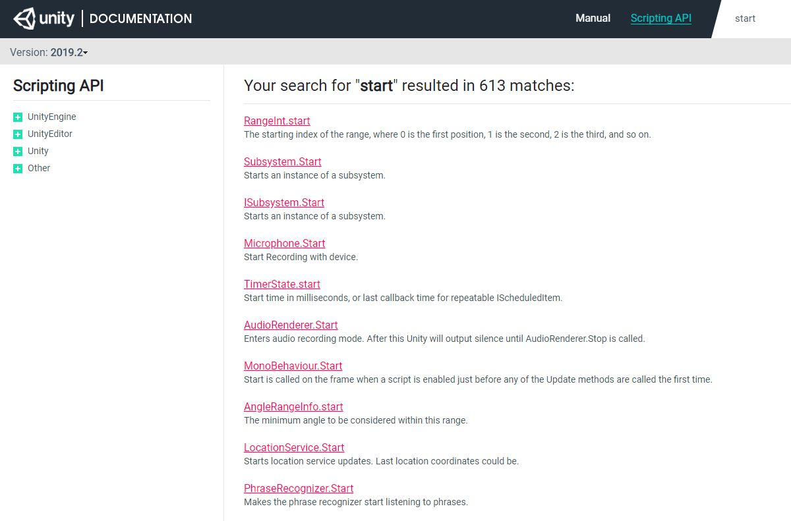
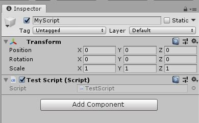
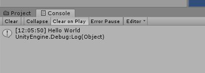

# Dice Game

Here we are going to write our first program.

## Structure

To begin we need to know where to actually write our code.\
In the Editor duh!\
Not exactly we can't just put it anywhere in this file. For this we need to use the ["Start()"](https://docs.unity3d.com/ScriptReference/MonoBehaviour.Start.html) function.

Let's just talk a bit more about those functions.\
The `Start` and `Update` functions are inside of the `class TestScript`. How do we know this? The `{}`!\
You can more or less think of `{}` or curly braces as a container. When we make our `class` we "open" a curly brace, put what we want in the class inside the brace, then "close" the brace.\
So if you look at the code below you'll notice after we "declare" our `class` we have a `{` then at the bottom of the code a `}`. So everything between these two brackets is inside the `class TestScript`.

```csharp
public class TestScript : MonoBehaviour {

	// Use this for initialization
	void Start() {
	
	}
	
	// Update is called once per frame
	void Update() {
	
	}
}
```

This is what is contained within the class `TestScript`. Using this same logic we can apply it to the `Start()` function. Look for the curly braces just after it.

```csharp
	void Start() {
	
	}
```

### Using The Scripting API

Now why do we want to use the `Start` function?\
We're going to try out using the [Unity Scripting API](https://docs.unity3d.com/ScriptReference/) for this.\
Say we were perusing through this code and we stumbled across this function and didn't know what it does. Well, we'd go to the Scripting API and search "Start", the name of the function, up. When you do, you should be greeted by this :



This is a list of all the `Start` functions in Unity. Now we need to find the one we are actually using in our script.\
In this case we should look at the class we are using. In the [last lesson](./1%20UnityScripts.md/#classes) we mentioned how the `TestScript` class we made is ["inheriting"](https://docs.microsoft.com/en-us/dotnet/csharp/tutorials/inheritance) from the `MonoBehaviour` class.\
With this logic we can say that the `Start` function is part of the `MonoBehaviour`. When we look at our search result, you can see that the seventh one down is ["Monobehaviour.Start"](https://docs.unity3d.com/ScriptReference/MonoBehaviour.Start.html). Click on that.

On this page, Unity tells us everything about `MonoBehaviour.Start` that we need to know.

> Start is called on the frame when a script is enabled just before any of the Update methods are called the first time.
> Like the Awake function, Start is called exactly once in the lifetime of the script. However, Awake is called when the script object is initialised, regardless of whether or not the script is enabled. Start may not be called on the same frame as Awake if the script is not enabled at initialisation time.

This might sound a little confusing as it is written by and for more experienced developers. That is ok though, you'll begin to understand it better as we go along.\
For now I will paraphrase it.

> The Start function is run as soon as the script becomes active in your game. It's only ever called once.

When we press play in our game if our script is loaded onto an object (we'll get to that [later](#adding-scripts-to-objects)) the `Start` function on that script (if there is one) is run.

Since we want our code to run by itself we will write it inside this function we can type it on the line after `void Start() {` but before the `}`.\
Let's type this in `Debug.Log("Hello World");`. For now just write this exactly and we'll customize it later.\
The function should look like this :

```csharp
	void Start() {
		Debug.Log("Hello World");
	}
```

## Syntax

Before we continue we should talk about my spacing. You'll notice that the `Start` and `Update` functions are tabbed in and now the `Debug.Log` is tabbed in again.\
This is to ensure our code is "readable" so when have to come back to it or someone else wants to look at the code it is very easy to see where everything is and what it does.\
The main idea with tabbing in our code is that we want to be able to see what is inside of what. `Debug.Log` is inside our `Start` function. We know this because of the curly braces. So we make `Debug.Log` indented a little further than start.\
Most editors (like the one Unity will have opened for you) automatically indent your code and help maintain a standard "Syntax". Syntax is our fancy word for the formatting of code.

There are tons of rules you can follow for writing syntactically nice code. Certain people prefer certain rule sets over others. This is mainly down to personal choice but it is **extremely** encouraged to follow a rule set, otherwise you will not have a good time.\
There are too many rules to go over here so I will give you [this resource](https://dzone.com/articles/10-tips-how-to-improve-the-readability-of-your-sof) to read up on. Not everything might make sense now but as we move on continue to refer back to it.

There are three points of syntax I will touch on specifically.

### White Space

White space is spaces " " just like that. C# is a white space insensitive language.\
Meaning :

```csharp
	void     Start                   ( )  {
Debug  .   Log     ("Hello World"   )      ; 
			}
```

That will run just just as well as what we had above.\
Just remember that if you ever code like this and someone tries to use your code they might try and snuff you out.\
Just because you can does **not** mean you should.

*Note that inside of quotes `""` __is__ white space sensitive. You'll find out why in the next lesson.*

Here is a little write up of the syntax used in these courses if you'd like to use it.

//ADD SYNTAX FILE

### Case Sensitivity

Case or capitalisation is important in C#. `Debug.Log()` is **not** the same as `debug.log()` or `deBUG.loG()`.\
Every* pre-written function in Unity is written in ["UpperCamelCase"](https://whatis.techtarget.com/definition/UpperCamelCase).\
UpperCamelCase is a type of CamelCase. CamelCase is a naming convention in which words are written with no spaces and instead use capitals to denote each word.\
UpperCamelCase just means that the first letter is capitalized along with the first of each subsequent word.

So `my code program` is written in UpperCamelCase as `MyCodeProgram`. As you'll notice this is the same as Unity's functions like `Start` or `UnityEngine`.\
It is typically recomended to use this yourself in order to have your code look the same as to avoid confusion.

Now that is for Unity's functions, classes, and the likes. Unity does use lowerCamelCase for it's variables. We will talk about what variables are in the next lesson. For now just know they are written in lowerCamelCase. I bet you can guess what that means.

A variable we wanted to call `my great variable` would actually be called `myGreatVariable`. We'll leave the examples alone for now. Again this is usually recomended to follow these guidelines for now.

### Comments

We already talked about comments in the [last lesson](./1%20UnityScripts.md/#comments) but will mention them again.\
Comments are invaluable to keep track of code you write. You might think you can remember it all but trust me, you can not.\
Use comments to quickly tell you what a block of code, or function, does. You don't need to use it for obvious things.

Good : `// Returns the average of all elements in an array`

Bad : `// Adds two numbers` or `// blahh it does some stuff`

All the code written in these lessons will be using my prefered syntax. It's recomended to use it as well until you understand enought to figure out what you'd prefer and set up your editor to help.\
Just follow along with my spacing and indenting but remember it does not need to be exact. You'll pick up these skills along the way.

## Adding Scripts To Objects

Save this script and return to Unity.\
Now we need to put our script into the scene. We do this the same way we put a component on our object.\
Let's just create a new "Empty Object" and give it a name.\
Click onto it and add our script to it. Just like you would with the collider. The name of the component will be the same you gave the script.\
It should look like this after :



Now hover over "Window" along the top bar, go down to "General", and then find and click on "Console". This brings up the Console which is where Unity will type messages for us from errors, code, and the likes.\
With this open, run the game. You should see :



And there you go. You've written code and passed the age old tradition of saying "Hello World".\
Now how did we do this? This might seem like a lot of info but trust me, once you get it all on paper you can break it down easier.\
Let's start small and work upwards.  

## How This Works

What does `Debug.Log("Hello World");` actually do? There's four parts to this :  

1. `Debug` is a class in Unity. We mentioned classes in the last [lesson](./1%20UnityScripts.md). In this case the class `Debug` contains lots of different functions we can use to "debug" or find and fix problems in our game.\
To use the `Debug` class simply type it and make sure you have `using UnityEngine;` at the top of your code.

1. `Log()` is one of the functions in the class `Debug`. In this case the `Log` function "prints" out text into the Console that we opened up a moment ago.\
Because this function is part of the `Debug` class we need to call from the class. What this means is if were to just call `Log("Hello World");` our code would error. Feel free to try this if you want to see for yourself.\
They way we call `Log` on `Debug` is by using the period `.` or the dot as it is commonly refered to. The dot allows us to "access" function or variable from something like a class.\
When we write `Debug.Log` we are calling the `Log` function that is part of the `Debug` class.\
We also have the brakcets, `()`. These are similar to the curly braces but rather than containing the code to make up a function or class they contain the values "pased" into our function.

1. `"Hello World"` is a "string" passed as a value into the function `Log`. These values must be within the brackets `()` of the function.\
In the next lesson we'll talk about what string means so for now just call it a value. A function can take values and use them to do just about anything, in our case write out the value.\
The quotation marks `""` are specific to strings and not any value passing into a function.

1. `;` denotes the end of a command. A command can be setting variables, functions, and a bunch more. Typically every line of code (not of the text editor) needs to end with a semi colon.\
Obviously there is not a semicolon after the curly braces. I hesitate to say this is a rule but it is the norm.

As shown above we have looked the structure that upholds the rules of code. Code not written with these rules will error and not run.\
In the next lesson we will go over some more of the building blocks of code and will begin to manipulate data.
