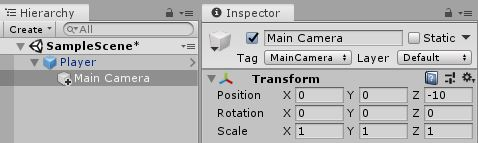
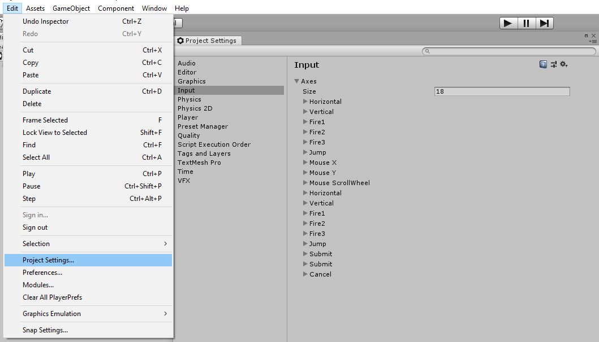
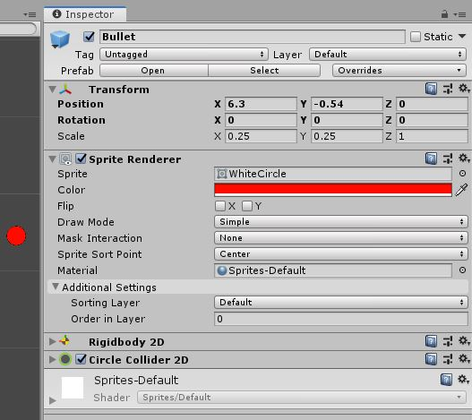
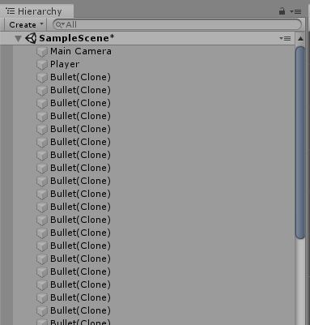
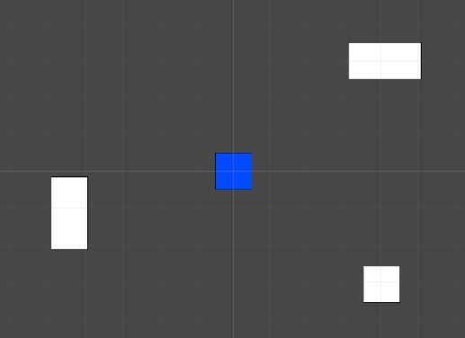
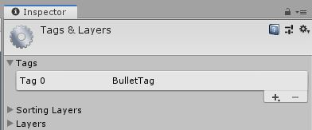

# Top Down Arcade Game

This is where we will begin adding in player interaction to our game with movement and shooting.

## Capturing Inputs

Before we start writing some scripts make sure you add a scripts folder to your project.\
Put in a new script and let's call it "PlayerMovement". Then open that up.

Unity has a very convenient way for us to get input with the ["Input Class"](https://docs.unity3d.com/ScriptReference/Input.html). On this class there are two main functions we want. ["GetAxis"](https://docs.unity3d.com/ScriptReference/Input.GetAxis.html) for movement and ["GetButton"](https://docs.unity3d.com/ScriptReference/Input.GetButton.html) for button presses.\
To use these we simply need to call the function from the `Input` class (just like `Debug.Log`). In the case of `GetAxis` we pass in a `string` of which axis we want to get. For us, the ones we'll use are `"Horizontal"` and `"Vertical"` which by default tell us if the player is pressing "WASD" or the arrow keys.\
For `GetButton`, which we'll use a bit later, we pass in a button name and the function will tell us whether that button is pressed.

***Note***
The names of these axes are set through the ["Input Manager"](https://docs.unity3d.com/Manual/class-InputManager.html). You can also add new ones. We will talk more about this in a [section](#setting-up-button-inputs) later on.

## Player Movement

To start let's make sure we know how to use the `Input` class. We will start by just printing out our key press then modify it to actually move our player.

### Printing Movement

So in our PlayerMovement script let's simply print out the horizontal axis to start.\
In our `Update` function let's add the following.

```csharp
void Update() {

	float hAxis = Input.GetAxis("Horizontal");
	Debug.Log(hAxis);

}
```

Here we've stored the value returned from `GetAxis` to a `float` called `hAxis`. The `GetAxis` function returns a `float` and more specifically a number between -1 and 1.\
This is to inform us of the magnitude of input as well as direction. What we mainly care about is the direction because without using a joystick our key presses don't have a "half pushed" mode, they are simply down or up.\
The direction is referencing the grid used by Unity for transformations. Basically meaning the sign of `GetAxis` (positive or negative) relates to the grid in Unity where positive horizontal axis means moving right on the grid.

Now to test that code we've written.\
First save the script and return to Unity. Go to your "Player" prefab and add the "PlayerMovement" script to it. Then run the game and watch the console as you press A and D or Left and Right arrow keys.\
Hopefully this should illustrate how the `GetAxis` function works. Please try to change that code to show the vertical axis too and try that out.

### Moving The Player

Now we can actually use our input to move our player object around the game world.

First let's think of how we can do this.\
Our player's position in the game is based on the objects Transform component. However, we have a Rigidbody on our player which we use for collisions. This means we need to move the player using the Rigidbody.

In our script let's start by storing the vertical and horizontal axis values in a ["Vector2"](https://docs.unity3d.com/ScriptReference/Vector2.html) that's declared above the `Update` function.\
We need to use a `Vector2` so we can store two numbers, an X and Y position. This is not only convenient but also necessary because other parts of Unity require data to be in this form.\
Declare it just like a normal variable, just with `Vector2` as the type, and you can access it's X and Y value simply by using `.x` and `.y`.

```csharp
Vector2 movement;

void Update() {

	movement.x = Input.GetAxis("Horizontal");
	movement.y = Input.GetAxis("Vertical");

}
```

That takes care of where we want to move to now we need to actually move.\
As said before, we have to move the Rigidbody of the player. To start add a reference to the Rigidbody of the player using the `Start` function.

```csharp
Rigidbody2D rb;

void Start() {

	rb = GetComponent<Rigidbody2D>();

}
```

A **very** key thing to note is that since the Rigidbody is based on physics we need to update it in what's called the ["FixedUpdate"](https://docs.unity3d.com/ScriptReference/MonoBehaviour.FixedUpdate.html). This is very similar to `Update` but it's for physics.\
We will be using a function called ["MovePosition"](https://docs.unity3d.com/ScriptReference/Rigidbody2D.MovePosition.html) to move our Rigidbody to a given position. Put in the following into your script :

```csharp
void FixedUpdate() {

	Vector2 moveTo; 
	rb.MovePosition(moveTo);

}
```

Of course this doesn't work as is. We need to figure out where we want to move to ourselves because `MovePosition` will move us straight to the spot and not smoothly transition. We need our current position (this time it's actually the Rigidbody's position) plus where we want to go (the movement vector we made)

```csharp
void FixedUpdate() {

	Vector2 moveTo = rb.position + movement * Time.fixedDeltaTime;
	rb.MovePosition(moveTo);
 
}
```

What's this `Time.fixedDeltaTime` thing? This is simply a `float` that tells us how long it's been since we last ran `FixedUpdate`. It's not needed but makes your code run a bit smoother.\
Hop back to the game and try this out.

Now we'll likely need to adjust that speed. First we will set this up and then make it editable from Unity rather than our text editor.\
To start we know that we are adding a number between -1 and 1 to our movement vector. Because of this we can declare a max speed and use the value from our axis to give us a ratio of that max speed.\
Start by adding in a new `float` and call it `maxSpeed` or similar. We then want to multiply our `moveTo` vector by that number.

```csharp
void FixedUpdate() {

	float maxSpeed = 1f;
	Vector2 moveTo = rb.position + movement * Time.fixedDeltaTime * maxSpeed; 
	rb.MovePosition(moveTo);

}
```

Obviously setting `maxSpeed` to `1` does nothing to our speed. You could open your script and change this to a different value but there is a better way.\
So far we've only worked inside the `Update`, `FixedUpdate`, and `Start` function but if you look up you'll see that these are inside a class named after the file. One very useful part of this class is that we can declare a variable outside of functions and set the value of that variable in Unity.\
To start move the declaration of `maxSpeed` out of the update function but still within the class, in this case called `PlayerMovement`. It doesn't matter where about you place this but to make your file look nice, and remain readable, variables are typically the first thing in a class. Like so :

```csharp
public class PlayerMovement : MonoBehaviour {

	float maxSpeed = 1;

```

Now this will still work, but we can't change the value of `maxSpeed` with Unity yet. To do this we need to make the variable ["public"](https://docs.microsoft.com/en-us/dotnet/csharp/language-reference/keywords/public). We just need to put `public` in front of the variable. Like :

```csharp
public float maxSpeed = 1;
```

Now save that and return to Unity. Click on your Player object and under the PlayerMovement script you should see an option for "maxSpeed". Try setting this value and playing the game!\
Now a fun thing you can try to illustrate the usefulness of this `public` keyword would be to put a second Player prefab into your game and give the second one a different `maxSpeed` value to the first.\
When you play the game you can see that even though these two objects use the same script they can have different values. This means that, just like prefabs, we can make one script and use it as many times as we like. Also using `public` speeds testing up tenfold. It's also good to note that anything you can turn into a variable can be `public`. Use it whenever you want to quickly alter values.

### Following The Player With The Camera

With our player moving it is obvious that the camera needs to follow the player otherwise we cannot see the player. There is a really simple way to do this but really only works when our player does **not** rotate.\
All we need to do is ["child"](https://docs.unity3d.com/Manual/Transforms.html) our [Camera](https://docs.unity3d.com/Manual/class-Camera.html) object to our player. This will make the transform of the camera relative to the player rather than the center of the world.\
Now we want the camera's transform to be `0` for X, `0` for Y, and a negative number for Z. This is because we want the camera centered on the player, that's the X and Y, but it needs to have a negative Z as to not be on the same plane as the player. That is to say :\
If the camera's Z is also 0 it will be at the same level as the player and cannot see it. Just like you cannot see something directly beside you.



If you do want your player to rotate (like if you are going to use the [MouseAim script](./Library/MouseShooting.cs)) you will need to add this [simple code](Library/CameraFollow.cs) to a script and place it on the camera.

```csharp
public class CameraFollow : MonoBehaviour {

	// Set this to the player in the game (NOT the prefab)
	public GameObject player;

	// Stores the difference between the player and camera
	Vector3 offset;

	void Start() {

		offset = transform.position - player.transform.position;

	}

	// Update is called once per frame
	void Update() {

		// Update the cameras position
		transform.position = player.transform.position + offset;

	}
}
```

If you use this script, you must do two things.

* Do not have the camera childed to the player for this 
* Place the camera where you want it in relation to the player before you start the game.

Use the above code for now, the [version](Library/CameraFollow.cs) in the [Library](Library) is slightly more advanced to allow for a smoother feel.\
This will be what is used for the rest of these lessons, though it does not affect you very much.

## Shooting

We've got a moving player, now let's try to add a basic shooting mechanic to our game. What we are going to build here is a basic four point shooting system. What that means is we can shoot up, down, left, and right.\
This will be expandable to an eight point system (four point plus diagonals) and included in the script library will be a [mouse shooting script](./Library/MouseShooting.cs) (aim with the mouse 360 degrees around your player).\
Don't worry about that yet though, onto the basic four point system.

### Setting Up Button Inputs

First thing to do is to make a new script called "PlayerShoot". Make sure to put it into the Scripts folder. Open it up.\
Now this script will be controlled with the arrow keys by default. Which means we need to change our inputs because currently the arrow keys can move our character as well.\
This is because the arrows keys are by default to set to be in the Horizontal and Vertical axes. The same ones we used in our movement script.

We need to open up our input manager. In the top left go to "Edit", then down to "Project Settings". Once that opens, click on "Input".



This is the input manager. In here we can change which buttons correspond to which axis. We need to move the arrow keys from the Horizontal and Vertical axis to new axes that will be for shooting.\
Click on "Horizontal" from the list of axes. Find "Negative Button" and "Positive Button" and delete their corresponding keys ("left" and "right" in this case). It's ok that those two fields are now empty because these axes have alternate keys specified.\
Do the same for the "Vertical" axis and then play your game. You will notice that the arrow keys no longer move the player, but WASD does move it.


With that we are good to go and can start writing a script for shooting.

### Printing Shooting

Just like with movement we are going to start simple by just detecting our key presses. Make a new script (in the scripts folder) and name it "PlayerShoot" or similar.\
In the `Update` function we need to detect our key presses similar to our movement but not exactly. We are going to use the method ["Input.GetKeyDown"](https://docs.unity3d.com/ScriptReference/Input.GetKeyDown.html) which uses the key names rather than an axis name.\
This function returns a `boolean` that is `true` if the key was pressed that frame and `false` otherwise. Because of this `boolean` we can stick the function directly into an `if` statement. Let's try printing something if the player press the key "up". Put this in the `Update` function just like before.

```csharp
void Update() {

	if(Input.GetKeyDown("left")) {
		Debug.Log("Left");
	}

}
```

Put this script onto your player and try running the game. You should be able to move with WASD and by pressing <kbd>&#8592;</kbd> the console will say "Left".\
Perfect. Now we just need to expand this to use all four arrow keys. Let's start by adding in the right arrow key. To do this, add an `else if` to our current code. Then changed which key we are using and the output.

```csharp
void Update() {

	if(Input.GetKeyDown("left")) {
		Debug.Log("Left");
	} else if(Input.GetKeyDown("right")) {
		Debug.Log("Right");
	}

}
```

We want to use the `else` statement here because you cannot move left and right at the same time. This makes it so only one can run each frame. Go ahead and try this out.\
Next we add the <kbd>&#8593;</kbd> and <kbd>&#8595;</kbd> keys to this. We want to duplicate what we currently have so that left and right are an `if else` and up and down are a separate `if else`.

```csharp
void Update() {

	if(Input.GetKeyDown("left")) {
		Debug.Log("Left");
	} else if(Input.GetKeyDown("right")) {
		Debug.Log("Right");
	}

	if(Input.GetKeyDown("up")) {
		Debug.Log("Up");
	} else if(Input.GetKeyDown("down")) {
		Debug.Log("Down");
	}

}
```

Now let's move on to turning this into actually shooting a bullet.

### Making A Bullet Prefab

Before we can shoot a bullet, we need to make a bullet. First let's outline what we are actually about to do.\
We are going to make a bullet prefab. Then in our `PlayerShoot` script we will spawn an instance of the bullet prefab and give it a velocity. With that in mine we can make a simple bullet prefab.

* In your scene make a new sprite (just like with the player prefab) and name it "Bullet".
* Set the sprite to our [white circle sprite](../1%20Rube%20GoldBerg%20Machine/Assets/WhiteCircle.png) and give it a color if you want.
* Set the scale of this sprite (under the transform) to around `0.5` or whatever looks best in comparison to our player.
* Add a Rigidbody 2D to the bullet.
* Add a Circle Collider 2D to the bullet. Make sure the size is right.
	* Also make sure you tick the box that says ["Is Trigger"](https://docs.unity3d.com/ScriptReference/Collider2D-isTrigger.html).



What is this "Is Trigger"? Well when two Rigidbodies collide they create a collision and just like real life they exert force on each other and get pushed back.\
You can prove this later by unchecking "Is Trigger", when the bullet hits the enemy they are thrown backwards and just kinda float away.\
Using the bullet as a trigger means that we can detect a collision but the physics engine doesn't make one. That means our enemy is hit by the bullet but does not get pushed back.

Once you have that, make it into a prefab by dragging it into the "Prefabs" folder we made.\
You should be able to get rid of the bullet in the scene now and just keep the prefab.

### Spawning A Bullet

Now that we have a basic bullet prefab we can start spawning it instead of just printing out a direction. Open up the `PlayerShoot` script.\
At the top of our script add in a new `public` variable of the type ["GameObject"](https://docs.unity3d.com/ScriptReference/GameObject.html). This will be used to store our bullet prefab.

```csharp
public GameObject bulletPrefab;
```
Save that and head back to Unity. If you click on the player prefab you will see the new variable under the PlayerShoot script. Drag the bullet prefab into that slot. This way when we run our game the variable `bulletPrefab` inside the `PlayerShoot` script.\
Go back into our shooting script.\
We are now going to replace the `Debug.Log`s inside our `Update` function with spawning a bullet. To spawn a prefab we can use the ["Instantiate"](https://docs.unity3d.com/ScriptReference/Object.Instantiate.html) function from Unity.\
The `Instantiate` function takes three arguments. The first is the actual prefab we'd like to create. Next it needs a `Vector3` containing the XYZ coordinates of the new objects Transform. The third defines the rotation of the object as a ["Quaternion"](https://docs.unity3d.com/ScriptReference/Quaternion.html).\
Here we've omitted the other `if` statements as they are trivial.

```csharp
void Update() {
	if(Input.GetKeyDown("left")) {
		Instantiate(bulletPrefab, transform.position, Quaternion.identity);
	}
}
```
Let's break this down a little. `bulletPrefab` refers to the variable we just made which is our bullet prefab.\
`transform.position` is the position of the player. `transform` refers to the transform component on the "owner" of the script, in this case the Player. We then call `.position` to get the `Vector3` that is our player's XYZ coordinates.\
`Quaternion.identity` is a predefined constant that refers to ["no rotation"](https://docs.unity3d.com/ScriptReference/Quaternion-identity.html). You don't need to worry too much about this as it is a high level math concept. Later we can show you an easier way to adjust rotation.

Now go back to Unity and run your game.

As you press the arrow keys you will see bullets popping out of the side of your player. Hardly bullets but still a great step!\
Now we will work on two more things to make these bullets better.

#### Adding Force To Bullets

First thing about our bullets is that they are rather lame. They need to go fast and because this is top down, gravity shouldn't affect them.\
To solve the gravity issue simply open up the bullet prefab, scroll down to the Rigidbody and set [Gravity Scale](https://docs.unity3d.com/ScriptReference/Rigidbody2D-gravityScale.html) to `0`.\
This just says that gravity should not affect this object.

Next we need the bullet to shoot off into the distance.\
Open up the PlayerShoot script. Add to our script a new function called "ShootBullet". This should return `void` and take one ["Vector2"](https://docs.unity3d.com/ScriptReference/Vector2.html) as an arguement (This is the same as a `Vector3` but with only an `X` and `Y`).

```csharp
void ShootBullet(Vector2 direction)
```

Now we want this function to spawn a bullet and then give it some velocity based on direction.\
Start by moving our `Instantiate` line of code from our `Update` to here. But we want to now set this equal to a variable. By doing this we hold a reference to the object we just spawned.

```csharp
void ShootBullet(Vector2 direction) {

	GameObject bullet = Instantiate(bulletPrefab, transform.position, Quaternion.identity);

}
```

This is no different to any variable you have seen. It's just that the value of the variable is now a instance of the Bullet prefab.\
Next we need to give the bullet some speed. To do this we need to add a force to the Rigidbody. Unlike the Transform, we need to use the `GetComponent` method to use the Rigidbody in our code.\
That will look like this :

```csharp
void ShootBullet(Vector2 direction) {

	GameObject bullet = Instantiate(bulletPrefab, transform.position, Quaternion.identity);

	Rigidbody2D rb = bullet.GetComponent<Rigidbody2D>();

}
```

This certainly will look foreign. Time to break it down.

* `Rigidbody2D rb` : We want to make a new variable of the `Rigidbody2D` type. This is just a normal variable but the value of it is a `Rigidbody2D`.
* `GetComponent` : This is simply a function that gets us a reference to a component of an object. It must be called on an object, in this case the bullet.
* `<RigidBody2D>` : This is part of the above function. It says we want to get the`Rigidbody2D` component from the object.
* `()` : That is just like a normal function's brackets.

In short, `bullet.GetComponent<Rigidbody2D>()` will give us the Rigidbody that is on our bullet.\
Now with that we can add a force to the bullet with the conveniently named ["AddForce"](https://docs.unity3d.com/ScriptReference/Rigidbody2D.AddForce.html) function. This takes in a `Vector2` as an arguement and applies it as a force to our object.\
We have to call `AddForce` on the Rigidbody of the object. So use the `rb` variable we just made.

```csharp
void ShootBullet(Vector2 direction) {

	GameObject bullet = Instantiate(bulletPrefab, transform.position, Quaternion.identity);

	Rigidbody2D rb = bullet.GetComponent<Rigidbody2D>();

	rb.AddForce(direction);

}
```

This will work but we don't have much control over the speed of the bullet. Let's make a new `public float` at the top of your script and name it `bulletSpeed`.

```csharp
public float bulletSpeed = 1;
```

Now we can just multiply the `direction` variable in our `ShootBullet` function by this new speed.

```csharp
rb.AddForce(direction * bulletSpeed);
```

*bulletSpeed will likely need to be a rather large number.*

Another way we could do this is by using ["ForceMode2D.Impulse"](https://docs.unity3d.com/ScriptReference/ForceMode2D.Impulse.html) like so.

```csharp
direction *= bulletSpeed;
rb.AddForce(direction, ForceMode2D.Impulse);
```
["ForceMode2D.Force"](https://docs.unity3d.com/ScriptReference/Rigidbody2D.AddForce.html) (The default ForceMode) adds force over time to an object whereas `ForceMode2D.Impulse` adds force instantly more akin to an explosion. This allows us to be able to set a lower `bulletSpeed`.

Time to add a call to the `ShootBullet` function in the `Update` function instead of just instantiating a bullet.\
You will need to give the function call a direction. What we want to use is `1` to mean up / right and `-1` to mean down / left depending on if it's in the x or y spot.\
Try to draw out the grid and figure out which directions to give to which key presses (You'll have to pass it like `new Vector2(X, Y)`).\
Don't simply guess and then look at the answer, go and try turning on the game and see if it works. Playing and testing your game is perhaps the best thing you can do to learn.

<details>
<summary>Calling the ShootBullet function</summary>

<br />

```csharp
void Update() {

	if(Input.GetKeyDown("left")) {
		ShootBullet(new Vector2(-1, 0));
	} else if(Input.GetKeyDown("right")) {
		ShootBullet(new Vector2(1, 0));
	}

	if(Input.GetKeyDown("up")) {
		ShootBullet(new Vector2(0, 1));
	} else if(Input.GetKeyDown("down")) {
		ShootBullet(new Vector2(0, -1));
	}

}
```

[Check out the "Static Properties"](https://docs.unity3d.com/ScriptReference/Vector2.html) and try using these in place of the `new Vector2(X, Y)` we've made here.

</details>

One last thing to do here, promise it's quick.\
Our bullets are hitting the Player's collider. Add this line into the `ShootBullet` function just below instantiating the bullet.

```csharp
Physics2D.IgnoreCollision(bullet.GetComponent<CircleCollider2D>(), GetComponent<BoxCollider2D>());
```

Read through the line and see if you can make sense of it. If not, try using the [Scripting API](https://docs.unity3d.com/ScriptReference/Physics2D.IgnoreCollision.html) page.

#### Deleting Bullets

Now what you may notice is that as we shoot a lot bullets the hierarchy fills up.



This is bad. Every time we create a bullet it will take resources to calculate the details about the object and will have to do these every frame, forever.\
We need to get rid of bullets once they are no longer needed. The first thing we should do is destroy the bullet when it hits something.

Go ahead and add some walls to the scene so that we have something to hit with our bullets.\
Just add some sprites and give them a box collider.



To destroy a bullet when it hits something we need to detect a collision on the bullet. Create a new script and name it "BulletDestroy" or similar.\
We are going to use the built-in function from Unity called ["OnTriggerEnter2D"](https://docs.unity3d.com/ScriptReference/Collider2D.OnTriggerEnter2D.html) for this. This will be called automatically when our bullet collides with something.

```csharp
public class BulletDestroy : MonoBehaviour {
	
	void OnTriggerEnter2D(Collider2D collision) {

	}

}
```

Lucky for us this should be simple as we can just destroy when we hit anything.\
Add into that function :

```csharp
Destroy(gameObject);
```

*Note the lowercase g*\
The bullets should now disappear when they hit anything.

There is a possibility that your bullets may collide with another bullet so there is one check we should add to our `BulletDestroy`.\
We can do this using ["tags"](https://docs.unity3d.com/Manual/Tags.html). These just put a name on an object more or less. We can then use these tags to easily check if we collided with a bullet.

Open up the bullet prefab. At the top of the inspector there is a dropdown for tags. It should say "Untagged".


Click on "Add Tag". This will open a new menu. There should be an empty list of tags. Hit the plus button and add a tag called "BulletTag".



Now double-click on your bullet prefab to bring it back into the Inspector.\
Click onto the tags as before but now add the "BulletTag". Save that and open up the BulletDestroy script.\
Around `Destroy(gameObject);` put an `if` statement. In the `OnTriggerEnter` function you can see that there is a ["Collider2D"](https://docs.unity3d.com/ScriptReference/Collider2D.html) passed in named "collision".\
That `Collision2D` object has a variable we can access that contains the info of object we collided with called ["gameObject"](https://docs.unity3d.com/ScriptReference/Collision2D-gameObject.html). On that we can access the objects tag.\
It would look like this :

```csharp
collision.gameObject.tag
```

Now we can compare if the object's tag to a `string` and see if it is **not** "BulletTag".

```csharp
void OnTriggerEnter2D(Collider2D collision) {

	if(collision.gameObject.tag != "BulletTag") {
		Destroy(gameObject);
	}

}
```

Now our bullets will not collide with other bullets.\
Now that these bullets are working perfectly we can move onto actually doing bullet things like dealing damage.

#### Bullet Lifetimes

Alright one more thing. This will be quick though, promise.\
You might notice that if you miss one of these walls the bullet will never be destroyed as it shoots off into infinity.\
We need to destroy the bullet after some amount of time in case it never hits anything. We can do this with a single line luckily!\
In our BulletDestroy script add this to the `Start` function.

```csharp
void Start() {

	Destroy(gameObject, 2);

}
```

As before, we are using the `Destroy` function to delete our game object (in this case a bullet). Lucky for us, Unity lets us pass in a `float` after the object we want to destroy. If you give a value here, Unity will destroy the object after that many seconds.\
Completely arbitrarily we've done two seconds here. Feels like if a bullet has not found a target in two seconds, it likely missed.

In the next lesson we will go over making a script to track the players and enemies health.

## On Your Own

Try to expand the current system to let you shoot on the diagonals. Try out creating a vector for the direction of the bullet, figuring out the values, then make a single call to `ShootBullet`.\
Also try adding a timer that limits how quickly you can shoot.

*Note*

* `GetKey` is different from `GetKeyDown`, try looking it up in the manual.
* Use `Time.deltaTime` to increment the timer.

After giving this a go you can look at [KeyShooting.cs](./Library/KeyShooting.cs) for an implementation of these two features.
