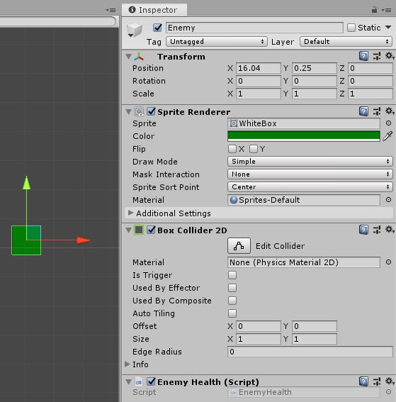
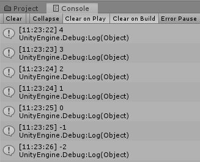
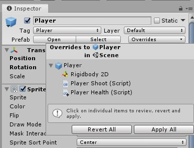

# Top Down Arcade Game

If we are going to be shooting we obviously need a way to detect when the bullet hits something and then react to that.\
This will look into detecting collisions, tracking health, and some basic enemies.

## Collision Detection

We already touched on this briefly in the [last lesson](./2%20PlayerInput.md#deleting-bullets). Let's get into it a bit more here.\
Any object in our game with a [collider](https://docs.unity3d.com/Manual/Collider2D.html) can detect collisions using the ["OnTriggerEnter2D"](https://docs.unity3d.com/ScriptReference/MonoBehaviour.OnTriggerEnter2D.html) function. Here we will only be using 2D colliders.

To start let's create a new sprite in our scene and name it "Enemy". Give it a sprite and a unique color. It also needs a collider. For now our enemy will just be a target and won't retaliate.\
With that we need to make a new script, let's call it "EnemyHealth". 



Open that up.\
Since we are going to be dealing with the collisions of our enemy we need to use the `OnCollisionEnter2D` function. Add that in just like we did with the bullet.\
We don't want to use the trigger function here as our enemy is not a trigger and, seeing as they can't shoot currently, we don't need to worry about triggers here.

```csharp
void OnCollisionEnter2D(Collision2D collision) {

	// Collision logic here

}
```

Now when our enemy collides with something this code will run. Obviously it does nothing right now but we can fix that.\
We only want the enemy to react to the bullets currently. Lucky for us we set up a very easy way to detect if we were hit with a bullet in the [last lesson](./2%20PlayerInput.md#deleting-bullets).\
But first we are going to set up the other object in the collision as a variable. This is a good bit to make a habit of.

```csharp
void OnCollisionEnter2D(Collision2D collision) {

	GameObject otherObject = collision.gameObject;

}
```

This will just make our code simpler and look nicer.\
Now just like before, we need to check what we collided with and using tags is very simple, so we will do it again.

Currently, our enemies do not shoot bullets so we can't use the same tag from before. We can implement this later but for now our enemies will be more like a zombie and just try to run into the player.\
We need to detect if the player has collided with an enemy and we will do this the same as with the bullet. Start by making and subsequently place a "EnemyTag" onto the enemy. If you need a reminder just see the section of [Deleting Bullets](./2%20PlayerInput.md#deleting-bullets) from the [last lesson](./2%20PlayerInput.md).

```csharp
void OnCollisionEnter2D(Collision2D collision) {

	GameObject otherObject = collision.gameObject;

	if(otherObject.tag == "EnemyTag") {
		Debug.Log("I've been hit!");
	}

}
```

Run the game and you should be able to see that whenever a bullet hits the enemy it will print out that it got hit.\
If you are curious to test this further simply try removing the tag on the bullet prefab and play again.

## Basic Health

With that working correctly we can begin to make this actually track health.\
If you think about any game you've ever played the health is just a number. Perhaps we should store our health with a number then? Make a new `int` called `currentHealth` or similar.\
It's a good idea to make this a `public` variable as so we can quickly change the value and balance the game. Feel free to give it a default value also.

```csharp
public class EnemyHealth : MonoBehaviour {

	public int currentHealth = 5;

```

Instead of printing out "Hit!" let's print out `currentHealth`. Now if we think about this code for a second you might be able to realize that our health does nothing.\
Each time the enemy is hit we simple print out the value of `currentHealth` without changing it. Once we're hit (by a bullet) we need to take away some health. Let's do that.

```csharp
void OnCollisionEnter2D(Collision2D collision) {

	GameObject otherObject = collision.gameObject;

	if(otherObject.tag == "EnemyTag") {
		currentHealth--;
		Debug.Log(currentHealth);
	}

}
```

Go and shoot your enemy! The console should look something like this :



It works, but there's a problem. Shouldn't the enemy die when it's health hits zero?\
Why yes! We need to add another `if` statement to check that if we are at or below zero health. If we are, destroy the enemy.

```csharp
void OnCollisionEnter2D(Collision2D collision) {

	GameObject otherObject = collision.gameObject;

	if(otherObject.tag == "EnemyTag") {

		currentHealth--;

		if(currentHealth <= 0) {

			Destroy(gameObject);

		}

		Debug.Log(currentHealth);

	}

}
```

Now as you can see, when we shoot the enemy enough they are destroyed! This is all we really need to make a basic health script. A number to keep track of the health and a collision that decrements that health.

// knockback ?? Extras section

## Player Health

For the sake of simplicity we are going to make the players health a different script. Make a new script and call it "PlayerHealth". To Save time copy over all the contents of the `EnemyHealth` class into the `PlayerHealth` class.

```csharp
public class PlayerHealth : MonoBehaviour {

	public int currentHealth = 5;

	void OnCollisionEnter2D(Collision2D collision) {

		GameObject otherObject = collision.gameObject;

		if(otherObject.tag == "EnemyTag") {

			currentHealth--;

			if(currentHealth <= 0) {

				Destroy(gameObject);

			}

			Debug.Log(currentHealth);

		}

	}

}
```

It's recomended that you remove the `Debug.Log`s from these two scripts as the player of the game cannot see the console. At least once you export the game. They are just fine now while we are working.\
Later we will create a heads up display to show things like health.

### Dealing More Than One Damage

With the current script we've written the character is only dealt one damage at a time. This is fine and works but what if we want to have an enemy that deals more damage?\
We won't get into too much detail here as we want to encourage you to try and figure this out on your own. Though we will describe the idea behind it.

To start, look at how we get a reference to the object we collided with. We can do more than that, in fact we can access a script we've put on that object and then use variables from them. It would look similar to this :

```csharp
int damageToDeal = otherObject.GetComponent<EnemyHealth>().damage;
```

Where `EnemyHealth` is the name of the script that contains the damage to deal and `damage` is a `public` variable.\
If you do this the next step is to replace `currentHealth--;` with `currentHealth -= damageToDeal;`.

If you want to have things like spikes for instance that will deal damage but not be able to be destroyed you will likely want to have this `damage` variable not on the health script.\
Instead make a new script called "DamageOnCollide" or similar. This doesn't need any code other than a 	`public` variable for how much damage to deal.

## Basic Enemy AI

This is going to be a basic way of having the enemy chase our player around the game.

### Setting Up The Enemy

Let's start by giving our enemy a Rigidbody2D. Just like before, set "Gravity Scale" to `0` and the "Collision Detection" to "Continous". Then create and add a new script to the enemy called "EnemyMove".\
We are going to do a quick and crude version of an AI for our enemy. It will simply to towards our player and try to slam into them.

First, in order to move towards our player we need to know where they are. Let's create some code to dynamically finds the player.

### Moving Towards The Player

```csharp
public GameObject player;

void Start() {

	player = GameObject.FindGameObjectWithTag("Player");

}
```

More tags! They are so lovely.\
The "Player" tag is pre-defined with Unity all we need to do is put it on our player.\
Since we've made some important changes to our player we should update the prefab. In the top left of the Inspector click the drop down that says "Overrides" and click "Apply All".



When we start the game our enemy will find the player using it's tag and store it as a variable we can use later.

```csharp
public GameObject player;

// Start is called before the first frame update
void Start() {

	player = GameObject.FindGameObjectWithTag("Player");

}
```

Youshould also put in a reference to the Rigidbody here as well, just like with the player. Add in a variable for the Rigidbody and use `GetComponent<Rigidbody2D>()` in the `Start` function to set the variable.

This will be fairly similar to our player's movement but with some changes. We will use the `MovePosition` function to move our enemy but this time we can use ["Vector3.MoveTowards"](https://docs.unity3d.com/ScriptReference/Vector3.MoveTowards.html) to figure out where we should move to.\
We won't need the `Update` function because we don't need to handle inputs so set up our code the same way as the player did.

```csharp
void FixedUpdate() {

	Vector2 moveTo; 
	rb.MovePosition(moveTo);

}
```

To set our `moveTo` variable we are using the `MoveTowards` function. This takes in three parameters. The current position, the target position, and how far we can move. Let's fill these in.

```csharp
Vector2 moveTo = Vector2.MoveTowards(transform.position, player.transform.position, moveSpeed * Time.fixedDeltaTime);
```

Exactly like with the player, the move speed (or to the `MoveTowards` function, the distance to move) we use our `moveSpeed` and multiply it by `Time.fixedDeltaTime` to keep it smooth.\
Remember to add the `moveSpeed` as a `public float` to the class.

### Rotating Towards The Player

Currently the enemy just stays orientated forward. If we want to have the enemy "Look at" the player we can use the following inside of our update function.

```csharp
Quaternion rotation = Quaternion.LookRotation(player.transform.position - transform.position, transform.TransformDirection(Vector3.up));
transform.rotation = new Quaternion(0, 0, rotation.z, rotation.w);
```

This may look a little ugly and it may well be. Don't worry too much about how it works but more that it does work.\
Remember if you don't want the enemy to rotate you should freeze the Z rotation of the Rigidbody.

That should do it for our basic AI. We now have something you could consider gameplay!

If you are happy with the way this enemy works you should make it into a prefab seeing as you'll likely want more than one enemy.

You may still notice one more problem. If our player dies the game just stops and Unity actually begins erroring.\
This is due to the camera, and now enemy, trying to find the player that has now been destroyed. In the next lesson we will talk more about Scenes and start switching between levels.

## On Your Own

Wouldn't it be cool if our enemy would only chase the player if the player was close to our enemy?\
Try wrapping the movement of the enemy in an `if` statement that checks how close they are to the player. Perhaps you could use ["Vector2.Distance"](https://docs.unity3d.com/ScriptReference/Vector2.Distance.html).