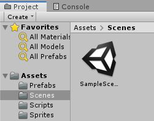
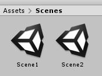
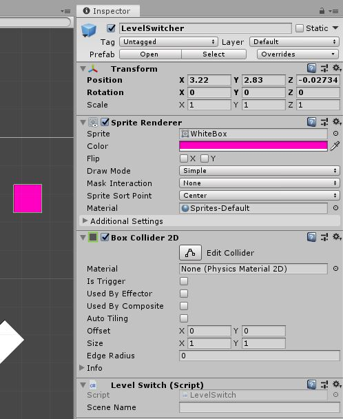
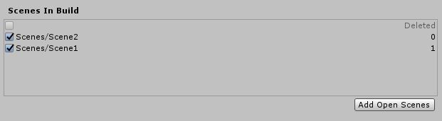

# Top Down Arcade Game 

Time to begin working with scenes, or levels.

## Scenes

We very briefly touched on this in the lesson on the [Unity Editor](../1%20Rube%20GoldBerg%20Machine/1%20UnityEditor.md) but here we will go into much more detail.

As stated before, ["Scenes"](https://docs.unity3d.com/Manual/CreatingScenes.html) are what Unity would call a level. The view you see in the editor is just one scene.\
To start, let's just start by making a new scene.

To make a new scene navigate to the "Scenes" folder in our project. There is likely the default "SampleScene" in there.



Right-click and go to "Create" then scroll down to "Scene" and click that.\
Now you'll see a new scene in the folder and you can name it something like "Scene2". Obviously when making a real name you'd want a much more descriptive scene name. While we're at it, change the sample's name to "Scene1".



If you click into the second scene you'll see there is nothing, great!\
Unity has loaded the new scene which is empty seeing as we just made it. Go ahead and stick some things in there. You will want to use the prefabs you've made.\
I would go back to the first scene and make the walls into prefabs and use those in the new scene. You will also need to remember to set up things like the camera again.

Once you have these two different scenes set up try switching between. You'll see each is entirely seperate.\
Go ahead and add some more scenes if you want.

Flipping between scenes isn't great for gameplay though. Luckily we can use code to switch levels.

### Switching Scenes

Start by making a new script and call it "LevelSwitch".\
What we want to do here is set this up so when our player hits the box we load into a different scene. What does our script need to do?

* Detect a collision with the player.
* Load a level that we choose.

To detect the collision we just need to add in the `OnCollisionEnter2D` function we've used previously. Also the same as before we need this to only work when colliding with the player.

```csharp
void OnCollisionEnter2D(Collision2D collision) {
	
	if(collision.gameObject.tag == "Player") {
		
	}

}
```

Great that takes care of the collision.\
Now we want to switch scenes. How do we do this? This takes a few steps.

First we need to add the following to the very top of our script :

```csharp
using UnityEngine.SceneManagement;
```

*Make sure this is beside all the other* `using` *statements.*

This more or less "adds" the functionality of changing scenes to our project.\
If we were to look up "Loading scenes in Unity" you would likely find this function, ["LoadScene"](https://docs.unity3d.com/ScriptReference/SceneManagement.SceneManager.LoadScene.html). This function allows us to load a scene based on it's name.\
Add this functions call in our `if` statement (You'll need to call it from the ["SceneManager"](https://docs.unity3d.com/ScriptReference/SceneManagement.SceneManager.html) class).

```csharp
if(collision.gameObject.tag == "Player") {
	SceneManager.LoadScene();	
}
```

This will produce an error because `LoadScene` needs to be given a string of the level's name. We want to be able to set this name from the editor so let's add a `public string` called "sceneName" to the class and pass it into the `LoadScene` function.

```csharp
public string sceneName;

void OnCollisionEnter2D(Collision2D collision) {
	
	if(collision.gameObject.tag == "Player") {
			SceneManager.LoadScene(sceneName);
	}

}
```

That should do it!\
Head back to Unity. We need to make a new object to be the "LevelSwitcher" so let's make one.\
For now it can just be a box. Give it a unique color and make sure it has a 2D collider.



It wouldn't hurt to make that into a prefab.

If you click on the object you can enter a string into the variable for `sceneName` in the inspector. This needs to be exactly the way you spelt the name of the scene. Here that should be "Scene1" (do the opposite of whichever scene you are currently on).\
If you run your game and run into the level switching object you will get an error along the lines of "Scene couldn't be loaded because it isn't added to the build settings". This means we need to add the scene to our build settings.\
How do we do that? Glad you asked.\
In the top left of Unity go to "File" and then click on "Build Settings". A window will appear and it should have "Scenes in Build" at the top. Make sure all the scenes you have are added here, you can use the "Add Open Scenes" to add the open scene.



Now when you run your game you should be able to switch to which ever scene name is set on the switcher.

That's the basics of switching scenes. Remember, you can call `LoadScene` from anywhere in your code, not just with collisions.\
Perhaps in the future you want to switch when your player dies. Well then you can put the code into your health script's death function. Possibilities are endless!

### Carrying Values Between Scenes

One thing you will likely want to do is carry data between scenes, perhaps a players health. There are a few ways to do this but we will try doing this in a very simple way.\
We will create a new script that acts as a manager for our data. Before we load into a scene we give data to it and when the next scene starts we pull that data from it.

To start create a new script called "DataManager" and open it.\
We need to make this class ["static"](https://docs.microsoft.com/en-us/dotnet/csharp/language-reference/keywords/static) which can be very complex but in the simplest terms it always exists and there's only one version of it.\
It should look like this :

```csharp
public static class DataManager {

}
```

Now we can define some variables as `public static type name` and use them. Let's start by adding a player health.

```csharp
public static int playerHealth;
```

Now this variable will exist "always".\
Before we load a scene we can now set this variable to the player's current health.\
Open up the level switch script and we can modify the `OnCollisionEnter2D` function to grab that health like so :

```csharp
void OnCollisionEnter2D(Collision2D collision) {
	
	if(collision.gameObject.tag == "Player") {
		DataManager.playerHealth = collision.gameObject.GetComponent<PlayerHealth>().currentHealth;
		SceneManager.LoadScene(SceneName);
	}

}
```

Now this `DataManager.playerHealth` is set to the same value as the player's current health. Remember that the object we collided with will be the player because of `if(collision.gameObject.tag == "Player")`.\
There is still more to do. This merely sets that variable, now we have to go into the `PlayerHealth` script and pull this variable down in the `Start` function.

```csharp
void Start() {

	currentHealth = DataManager.playerHealth;

}
```

When you run the game though you will see a problem. Our health starts at zero now. This is because the variable in `DataManager` was not set to anything at the start.\
You could simply set `DataManager.playerHealth` to a default value but this will make it more difficult to change these values as they can't be used like a normal public variable.\
If you want to use this method of passing variable you will likely have to stomach this inconvience. A slight "hacky" alternative would be to have a boolean declared that doesn't use the `DataManager`  the first time it's set.\
If you wish to try that you will have to figure out a way to set that up. For our uses, setting the value through the `DataManager` directly should work fine.

It should be quite trivial to add new variables to this script and hook them into other scripts start functions.

## Building Scenes

Now this is a very important subject. We need to discuss the "proper" way to build a scene in Unity (or any game design software that is) in order to reduce our headaches.\
When we started talking about [prefabs](./1%20Prefabs.md) we used them to place repeated objects, like a ball. We want to apply this idea to building scenes.

Rather than creating enemies, walls, boxes, everything in your game, one by one and piece by piece we need to use prefabs.\
By using prefabs liberally, we can increase the speed and ease of adding new scenes as well as making adjustments into a breeze.

Instead of jumping straight into making a finished scene start by making a development scene. This is where you will want to test new things as well as build prefabs. Treat it kind of like a playground.\
This way when you go to build scenes for the final game you will be able to quickly drag and drop assets into place the game.

Remember, it's easier to start with the foundation and building blocks rather as opposed to the top of the tower.