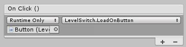

# Top Down Arcade Game 

We have working health and attacking so we should come up with a way to  display to the player all the stats.

## HUD

HUD stands for Heads Up Display.\
Unity has some great built in tools to display things like text and sliders to our players. Let's dive into this.

### Canvas

Start by making right clicking on the hierarchy and scroll down to "UI" and then click on ["Canvas"](https://docs.unity3d.com/Packages/com.unity.ugui@1.0/manual/UICanvas.html).\
This will create two new game objects, you need to keep both. You'll see some lines appear on the screen, this is the canvas. To get a better view select the canvas in the hierarchy and tap <kbd>F</kbd>. This is a good shortcut to remember, it will center the camera around a selected object.\
This canvas is where Unity will put all of our UI or HUD parts.


To start, how about we just stick a piece of text on our canvas.\
Right click on the hierarchy and scroll down to "UI" and then click "Text".\
You will see that Unity has automatically placed this as a child of the canvas object. Now if you look at your game you will see that there is some text displaying. If you play the game and move around you will see that the text does not move.\
This will be the base of our HUDs. Let's start by moving this to the top right corner to be our health display. You will notice there are some extra markers popping up, this is due to our text using a ["Rect Transform"](https://docs.unity3d.com/Packages/com.unity.ugui@1.0/manual/class-RectTransform.html) as opposed to the normal transform.\
This tool has some special features we want to take advantage of, for instance easily anchoring our text to a corner.

To do this click on the little box that appears in the Rect Transform component. A drop down will appear. This is the anchoring of our object.\
There are some fancy things you can do but for our purposes we want to hold <kbd>Shift</kbd> and <kbd>Alt</kbd> the click one of the corners, here it'll be top left.


This will put the text in the top left corner but it will also anchor it there. Meaning we can change the size of our game window and the text will remain still.\
You likely will want to offset the text so it isn't stuffed in the corner.\
Here we've also changed the default text, bumped up the font size, and colored the text to appear better.

// Edit for rect transform


That's great and all but it does not actually display our health. To do this we need some code, luckily we can do this pretty easily.

### Changing HUD Through Code

Open up the PlayerHealth script.\
At the very top we need to add a `using` statement.

```csharp
using UnityEngine.UI;
```

Then at the top of our class add in a `public` variable like :

```csharp
public Text healthText;
```

In a bit we will set this to the [text object](https://docs.unity3d.com/ScriptReference/UIElements.TextElement.html) we created.\
Now we need to change this text to display our health. the way we will do this is accessing the ["text"](https://docs.unity3d.com/ScriptReference/UIElements.TextElement-text.html) property of the text object. That will look like :

```csharp
healthText.text = "This text here";
```

This will change whatever text the object is displaying to what is after the equal sign.\
That's how you change it but now we need to figure out where to put this. There are two main options that will appear to work the exact same.

* The Update function. This would update our text every frame.
* Inside the collision function. This would update whenever our health changes.

Both work but since our health won't change every frame it would be more efficient to put this in our collision.\
We only want to change it if we actually take damage though so let's put this just below where we decrement our health.

```csharp
if(otherObject.tag == "BulletTag" || otherObject.tag == "EnemyTag") {

	currentHealth--;

	healthText.text = "Health : " + currentHealth;
```

As you can see here, we've added the `currentHealth` variable to the end of the string. You can set this string up however you want.

If you play the game and get hit by an enemy you will see that the text updates and displays your current health. But we have one more problem, before we've been hit there is no health displayed.\
This can be easily remedied by adding the same code to the `Start` function. You could also change this to perhaps say "Max Health" or do whatever you want. 

This functionality is not limited to health. You could set up displays like this to show what level or stage you are on, keep track of your ammo, what items you have equipped, or any other thing you could put into text.\
Displaying it is all the same.

### Sliders In HUD

The canvas is not limited to just text. How about we change up our HUD to use a health bar rather than numbers.

Unity has a built in UI element called a ["Slider"](https://docs.unity3d.com/Packages/com.unity.ugui@1.0/manual/script-Slider.html). We can use this to create a basic health bar.\
Go to the hierarchy, go to down to UI, and make a new slider.\
In our game you now have a slider and if you play the game you can control it with the mouse. This isn't what we want so let's do a few changes to make this into more of a health bar.

To start, you will notice that this object was created with a little handle. We don't want this for a health bar. This is just a childed object on the slider, go ahead and delete the "Handle Slide Area" object.\
If you play the game though you can still change the slider with your mouse. Giving ourselves more health is not something we want to do so we need to go back to the Slider object and under the Slider component you should see a check box labeled "Interactable". Uncheck this. Now we cannot modify the slider with our mouse.\
One more thing you can do is delete the child object called "Background". Here we will do this as it can make the bar look a little worse.

Just a few more settings. On our slider component we want to tick the box labeled "Whole Numbers" as we are using integers for our players health.\
You will see just above that a setting for the "Min" and "Max" value. We don't need to set these here because we will use code, that way it is easier to change our health later.


Finally, you will see that the color of the color of the slider is an ugly off-white. It's probably better to make this red like the text we made.\
This is a little odd, we can't just use the sliders that you see in the Slider component. Go to it's children and you will see one named "Fill", click this and set the color there under the "Image" component.\
Now we should be good to go. Let's head back to the player health script.

Make sure to anchor this slider to a corner, likely beside the health text.

#### Changing Sliders With Code

This is going to be quite similar to before.\
Start by creating a `public Slider` variable at the top of the script.

We need to first set that "Max Value" we mentioned before. Well the max value our slider can be would be the same as our max health. So in the start function we add :

```csharp
void Start() {

	healthText.text = "Health : " + currentHealth;
	slider.maxValue = currentHealth;

}
```

Now just like with the text, we need to set the value of the slider.\
To do this edit the `value` variable on the slider.

```csharp
currentHealth--;

healthText.text = "Health : " + currentHealth;
slider.value = currentHealth;
```

Now go back to your game, set that `slider` variable we made, and see this working.\
Hmm, there's a problem still. When the game starts the slider appears very small and once we take damage it becomes greater. This sounds just like the problem we had where the text was not set for the first frame.\
Luckily we can fix this in the exact same way. Just set the slider's value in the start function.

```csharp
void Start() {

	healthText.text = "Health : " + currentHealth;
	slider.maxValue = currentHealth;
	slider.value = currentHealth;

}
```

There we go! This game is starting to take shape.

*Note*\
If you want to make this slider bigger or smaller you can adjust it's width with the Rect Transform.

Once you are happy with the HUD you should make it into a prefab so you can easily set the same thing up in each scene.

### Buttons

The last big thing about the HUD is ["buttons"](https://docs.unity3d.com/Packages/com.unity.ugui@1.0/manual/script-Button.html).\
Currently we have two levels and we can switch between them with the level switcher we made. The next thing we need is a menu to start the game.

Make a new scene and call it "Start". Then create a new canvas here.\
We want to add a new button. This is under the UI dropdown just like all previous UI elements.\
Let's set the text on the button to say "Start". This is found on the child text object on the button.

The way a button works in Unity is that we can choose which functions to run from a script when clicked. Before we hook up the button let's create a function to load a level.\
We could jump onto a new script and start writing but that is a little unnecesary. We already have a script that does just that.\
Open up your LevelSwitch script. Here we want to add a new function called "OnClick". Then we can copy over the same code from the `OnCollisionEnter2D` function we made before. Except, we don't want to check if we hit the player.

```csharp
void onClick() {
	SceneManager.LoadScene(sceneName);
}
```

Nice and simple. We didn't even need a new script.\
Add this script to the button we just made. Then you can set the "Scene Name" to "Scene1" or whatever scene you want to switch to.\
Now if you look up at to the Button component you will see the bottom where it says "On Click ()" with an empty box. This is where we can set what happens when clickling the button.


Click the plus button in the bottom right. Now you will see a few more options appear.\
You will see a box right below the little drop down list that says "Runtime Only". Drag the LevelSwitch script from the button object to that box.\
Once you do that you will want to click on the other dropdown that currently says "No Function". Here you will see a list of objects that we can call functions from.\
At the bottom you should see the LevelSwitch script. When you hover over this you will see a list of things we can use. You won't see the `onClick` function. Why?\
Well this is because the function is **not** public. Just like variables, if we want to use a function in Unity's editor it must be public.\
Add the `public` keyword to our function just before `void` and then go back to Unity. You should now see this function on the drop down list.



If you run the game and click the button you will be loaded into whatever scene you set the `sceneName` variable to in the LevelSwitch script on our button.

You should be able to see how to expand this to a fully fledged menu where you could load into different levels or tutorials.\
Also remember, buttons are not limited to loading levels, you could just as easily set up an on screen button that, say, makes the player shoot!

### Images In HUD

// Check if wanted  
// Basic character portrait?