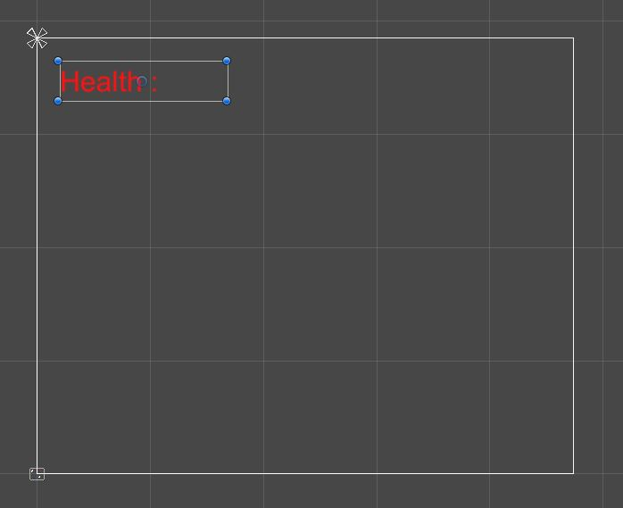

# Top Down Arcade Game 

We have working health and attacking so we should come up with a way to  display to the player all the stats.

## HUD

HUD stands for Heads Up Display.\
Unity has some great built in tools to display things like text and sliders to our players. Let's dive into this.

### Canvas

Start by making right clicking on the hierarchy and scroll down to "UI" and then click on ["Canvas"](https://docs.unity3d.com/Packages/com.unity.ugui@1.0/manual/UICanvas.html).\
This will create two new game objects, you need to keep both. You'll see some lines appear on the screen, this is the canvas. To get a better view select the canvas in the hierarchy and tap <kbd>F</kbd>. This is a good shortcut to remember, it will center the camera around a selected object.\
This canvas is where Unity will put all of our UI or HUD parts.

To start, how about we just stick a piece of text on our canvas.\
Right click on the hierarchy and scroll down to "UI" and then click "Text".\
You will see that Unity has automatically placed this as a child of the canvas object. Now if you look at your game you will see that there is some text displaying. If you play the game and move around you will see that the text does not move.\
This will be the base of our HUDs. Let's start by moving this to the top right corner to be our health display. You will notice there are some extra markers popping up, this is due to our text using a ["Rect Transform"](https://docs.unity3d.com/Packages/com.unity.ugui@1.0/manual/class-RectTransform.html) as opposed to the normal transform. This is basically the same thing except instead of representing a point (`Vector3`) it represents a full rectangle.

Place this somewhere that looks like a good spot to display health. Here we've also changed the default text, bumped up the font size, and colored the text to appear better.

That's great and all but it does not actually display our health. To do this we need some code, luckily we can do this pretty easily.

Open up the PlayerHealth script.