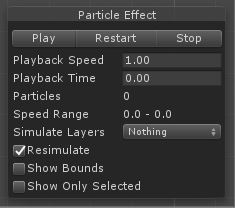
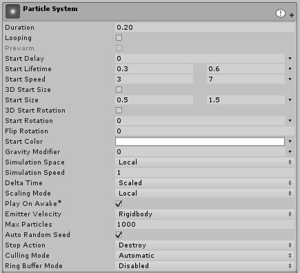
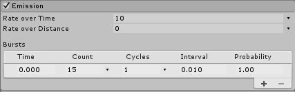
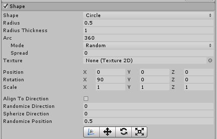
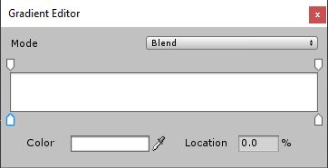
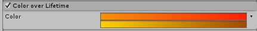
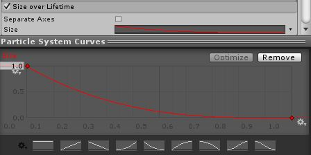
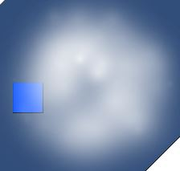

# Top Down Arcade

Not only should our game play good but it should also look good! Let's talk about ["Particle Effects"](https://docs.unity3d.com/Manual/ParticleSystems.html) and add some eye catching elements to our game.

## Particle Effects

We will be using particle effects to create a little explosion when our bullets hit something.

To start right click on the hierarchy, scroll down to "Effects" and create a new "Particle System". Immediatly you will see some particles flying through the scene. That's it, you're done!\
Alright kidding, we gotta do some customizing.\
You will see a massive list of options in the inspector, we can't cover everything here but you can find info on every piece in the [Unity Manual](https://docs.unity3d.com/Manual/). Here we will focus on a few ones to create a basic explosion because explosions are cool.

Let's go through top to bottom and setup a cool explosion.\
Throughout please remember, you do **not** have to follow the settings verbatim. Please go off the beaten path and make it look good to you. You can hover over the names of settings to get a little description.

You can edit / view your particle using the little context menu that shows up when you highlight a particle system in the editor. Usually you can just use the top three buttons to play it.



## Basic Explosion Effect

### Particle System

Here's what we will edit to make an explosion :

* Duration. we'll need to set this relatively low. In the area of `0.1` to `0.3`. This effects how long the system emits particles for.

* Looping, seeing as our explosion will happen once, uncheck this. This determines if the system loops.

* Start Lifetime, on the right of the box you will see a little arrow, click it and select "Random Between Two Constants". This allows us to have random variation in our particles which will make it more natural. These values should be quite low for an explosion, `0.3` to `0.6`.
This controls how long a particle is "alive" for.

* Start Speed, again set to "Random Between Two Constants". These values should be larger because explosions tend to be fast, `3` to `7`. This controls how fast our particles spew out.

* Start Size, set to random between about `0.5` and `1.5`. This controls how big a particle is to start.

* Start Color, you can set this if you'd like but we'll be overriding it later. This sets the starting color of particles.

* Play On Awake, Make sure this is ticked. This makes the particle start when it is created in the scene (kind of like running in the `Start` function).

* Stop Action, set this to "Destroy". This will get rid of our particle system when it finishes.

;

### Emission

* Rate Over Time, set this to around `10`. This will make a little a few extra particles spill out after the intial burst. This controls how many particles are emitted per second.

* Bursts, add in a burst with the plus sign. The defaults should be good here except the "Count". We've lowered it here because our bullets are small and wouldn't produce too much debris.



### Shape

* Shape, change this to "Circle". This controls the shape in which our particles can spawn.

* Radius, Decrease this to be closer to the size of the bullet. This controls the size of the circle.

* Randomize Position, set this to a small-ish number like `0.5`. This will make our particles have a varied spawn position and will be more natural.



### Color Over Lifetime

This time, you will need to enable this. There is a little white circle beside the name of this section, tick it. Do this for all settings that aren't enabled by default.

* Color, with the arrow on the right, set this to "Random Between Two Gradients". This means when a particle spawns it will be one of two random colors and then change colors as it's on screen. Click on the white box and this will open the "Gradient Editor".



Here you can click on the little white arrows on the bottom of side of the color box to choose a color for each point in the gradient.\
Here we'll set a nice orange to red and yellow to brown. Do whatever looks best you you though.



### Size Over Lifetime

* Size, here we see a ["Curve"](https://docs.unity3d.com/Manual/animeditor-AnimationCurves.html) which let's use change a value over time. If you click on the box shown here you can edit your curve, or select a preset from just below. We want our particles to decrease in size over time.



That should be looking like a pretty good explosion now! All that's left is to have this play when we shoot stuff.

## Using Particle Systems Through Code

To start we will make this explosion whenever the bullet hits something.\
Make the particle into a prefab and call it "ExplosionParticle".\
Then open up our "BulletDestroy" script. Here add a new `public GameObject` to the top of the script. Name it something about explosions.

Now we want to spawn this at the bullets position when it dies. Just like before we can do this :

```csharp
if(collision.gameObject.tag != "BulletTag") {
	Instantiate(explosionFX, transform.position, Quaternion.identity);
	Destroy(gameObject);
}
```

Make sure you set the explosion variable in the bullet prefab.

When our bullet hits something our explosion should spawn giving it a little more impact.

## Basic Fog Effect

Let's go through a few more examples. These will be much briefer than the explosion. This is mainly to pick up on the range of possibilities the particle system has.

Start by making a new particle system named "Fog". Then apply these settings :

* Particle System :
	* Duration, this should be fairly long, let's go with `20`. 
	* Start Lifetime, set this to the same as Duration.
	* Start Speed, set this very low, how bout `0.1`.
	* Start Size, set this higher, do `5`.
* Emission :
	* Rate Over Time, set this very low, around `2`.
* Shape :
	* Shape, set to `Circle`.
	* Randomize Direction, just set this to `1` so that our fog goes in random directions.
	* Randomize Position, you can do the same as above here if you want.
* Color Over Lifetime :
	* Color, this gradient should go from white to invisible. The way you can do this is by clicking on the little arrow on the top of the gradient in the gradient editor and changing the `Alpha` value. It may look better if it doesn't start fully opaque also.
* Size Over Lifetime :
	* Size, you will need to create your own curve here. It should start at or near zero, go up close to max, and then back to zero. You will need to add a third "Key" to the curve by right clicking on it.



You can always play around with these settings to make it look better but this should achieve a basic looking fog.\
Try out making the cloud bigger or smaller, perhaps there should be some different colors or sizes. What about a thick fog or a light mist. Go wild and have some fun.\
If you notice that the fog goes behind objects like the player try setting the `z` position a little bit into the negatives, that way it should be above the player but below the camera.

## On Your Own

Try making a particle to spawn when the enemy dies. In this case you might wanna do a big green splat.\

// Add in a basic fire, other particles