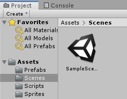
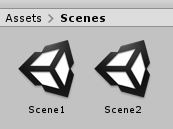
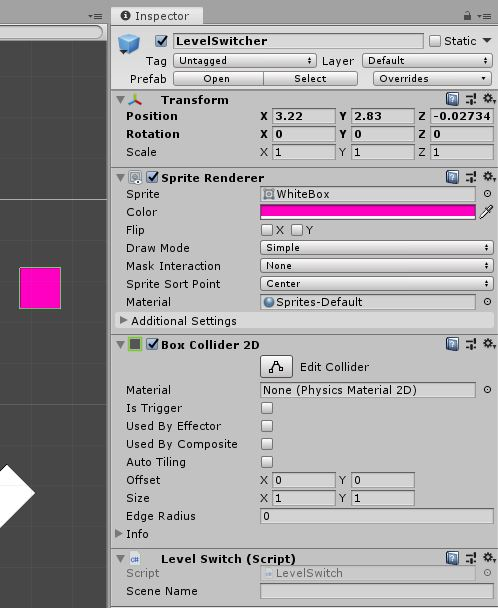

# Top Down Arcade Game 

Time to begin working with scenes, or levels.

## Scenes

We very briefly touched on this in the lesson on the [Unity Editor](../1%20Rube%20GoldBerg%20Machine/1%20UnityEditor.md) but here we will go into much more detail.

As stated before, ["Scenes"](https://docs.unity3d.com/Manual/CreatingScenes.html) are what Unity would call a level. The view you see in the editor is just one scene.\
To start, let's just start by making a new scene.

To make a new scene navigate to the "Scenes" folder in our project. There is likely the default "SampleScene" in there.



Right-click and go to "Create" then scroll down to "Scene" and click that.\
Now you'll see a new scene in the folder and you can name it something like "Scene2". Obviously when making a real name you'd want a much more descriptive scene name. While we're at it, change the sample's name to "Scene1".



If you click into the second scene you'll see there is nothing, great!\
Unity has loaded the new scene which is empty seeing as we just made it. Go ahead and stick some things in there. You will want to use the prefabs you've made.\
I would go back to the first scene and make the walls into prefabs and use those in the new scene. You will also need to remember to set up things like the camera again.

Once you have these two different scenes set up try switching between. You'll see each is entirely seperate.\
Go ahead and add some more scenes if you want.

Flipping between scenes isn't great for gameplay though. Luckily we can use code to switch levels.

## Switching Scenes

Start by making a new script and call it "LevelSwitch".\
What we want to do here is set this up so when our player hits the box we load into a different scene. What does our script need to do?

* Detect a collision with the player.
* Load a level that we choose.

To detect the collision we just need to add in the `OnCollisionEnter2D` function we've used previously. Also the same as before we need this to only work when colliding with the player.

```csharp
void OnCollisionEnter2D(Collision2D collision) {
	
	if(collision.gameObject.tag == "PlayerTag") {
		
	}

}
```

Great that takes care of the collision.\
Now we want to switch scenes. How do we do this? This takes a few steps.

First we need to add the following to the very top of our script :

```csharp
using UnityEngine.SceneManagement;
```

*Make sure this is beside all the other* `using` *statements.*

This more or less "adds" the functionality of changing scenes to our project.\
If we were to look up "Loading scenes in Unity" you would likely find this function, ["LoadScene"](https://docs.unity3d.com/ScriptReference/SceneManagement.SceneManager.LoadScene.html). This function allows us to load a scene based on it's name.\
Add this functions call in our `if` statement (You'll need to call it from the ["SceneManager"](https://docs.unity3d.com/ScriptReference/SceneManagement.SceneManager.html) class).

```csharp
if(collision.gameObject.tag == "PlayerTag") {
	SceneManager.LoadScene();	
}
```

This will produce an error because `LoadScene` needs to be given a string of the level's name. We want to be able to set this name from the editor so let's add a `public string` called "sceneName" to the class and pass it into the `LoadScene` function.

```csharp
public string sceneName;

void OnCollisionEnter2D(Collision2D collision) {
	
	if(collision.gameObject.tag == "PlayerTag") {
			SceneManager.LoadScene(sceneName);
	}

}
```

That should do it!\
Head back to Unity. We need to make a new object to be the "LevelSwitcher" so let's make one.\
For now it can just be a box. Give it a unique color and make sure it has a 2D collider.



It wouldn't hurt to make that into a prefab.