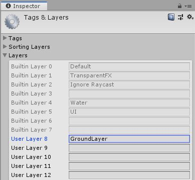

# Platformer

Here we will talk about using a player controller to move our player around the scene.

## Using the PlayerController

Lucky for you we will be using a premade controller for the platformer. This controller will deal with all the physics of moving, jumping, and more. We still need to capture input and hook this up to other scripts like a health script or animations.

Let's go through the basics of setting up an input controller for our script.

### Object Setup

First things first, drag the ["PlayerController"](./Library/PlayerController.cs) script into your scripts folder (or just copy the contents and make sure to name the file exactly the same).

Now create a new object for your player.\
To start let's give this a sprite. You could just use the [box](../1%20Rube%20GoldBerg%20Machine/Assets/WhiteBox.png) and [circle](../1%20Rube%20GoldBerg%20Machine/Assets/WhiteCircle.png) sprites we have been using.\
The only slight problem with that is we want to see which way the player is facing so you might want a sprite with distinct sides. Check in the [assets](./Assets/Knight.png) folder if you don't have one already.

Put the `PlayerController` script on this object.\
At the top of the `PlayerController` script you will see there are a few requirements.

```csharp
 * Ensure you attach this to an object with a 
 * Rigidbody2D, a "head" Collider2D, a "foot"
 * Collider2D, and a childed empty object at the
 * bottom of the main objects feet.
```

To start, give this a object a "Rigidbody2D" to start. You can leave the default settings as is now.\
Next we need a "head" collider. This is simply a collider to cover the top half of the object. This can be whatever collider fits best, a box, circle, or capsule, as long as it's 2D.\
Use the "Edit Collider" button to change and shift this into position. Obviously it depends on what sprite you will be using but it will likely look something like this :


Now we need to do the same with the "feet". You can simply add this collider to the same object and then set up the size to be correct.\
There is an important note here. You really should use a circle or capsule collider for this and **not** a box collider.\
This is because have the sharp corners of a box can limit the movement of your player by getting caught on edges or being unable to climb slopes.\
Do not worry if there is a little bit of your sprite not covered by the colliders, it will not make a noticable difference.\
Your colliders may look something like this :


#### Notes About Multiple Colliders

Before now you may not have realized that it is possible to have multiple colliders on a single object.\
It is important to note that there are two very common caveats to this method.

The first is that colliders can "catch" on other objects if they are not laid out properly.\
If your head collider is wider than the foot collider you might find your character getting caught on edges. Notice in the picture above that the bottom edge of the head collider does not poke out of the foot collider.

Likely the bigger thing to remember is when you are trying to detect collisions.\
If you were to put a `OnCollisionEnter2D` on the player right now it would fire right away as the colliders are touching. You will need to add a check, such as with tags, to ignore collisions with the object that has both the colliders.

Awesome, with that all on the player we can hook it up to the `PlayerController` now.\
Now we can hook this into our controller.

* Put the Rigidbody into it's slot.
* Put the bottom collider into the `footCollider` variable.
* Finally put the "head" collider into the spot labeled `crouchDisableCollider`.

There is one more setting we need to set, `whatIsGround`. This is a layer that tells us what is considered the ground in the game. For this we will create a new ["Layer"](https://docs.unity3d.com/Manual/Layers.html) called "GroundLayer" and assign it to anything you want the player to stand on.\
We can do this by creating a new sprite called "Ground" and give it a temporary sprite and ["BoxCollider2D"](https://docs.unity3d.com/Manual/class-BoxCollider2D.html). Then go to the top of the inspector window where it says "Layer" and click it.




Here we will simply click "Add Layer" and then call it "GroundLayer". Make sure you set every ground object to be on this layer. You do that by clicking the layer dropdown and clicking on "GroundLayer".

Now we can go back to the `PlayerController` script and on the `whatIsGround` variable we can select the new "GroundLayer".\
That should be it for the object setup. Changing the other values is just up to your personal preference but you'll need to wait until the player is moving to tell what's going on.

### World Setup

To move around a world we obviously need a world. Let's create a few platforms to start. Remember that anything the player walks on needs to have a 2D collider **and** be part of the ground layer.


As you can see we've set up a couple platforms to test our movement in. On the right you see a basic ground block. It would be easiest to make that a prefab and place those into the scene rather than making a new block every time.\
If you want to then change the shape of the block just modify the "Scale" of the Transform.

With that all set up we can begin to create a script that captures input to move this controller.

### Input Controller

As stated [before](#using-the-playercontroller), the controller deals with all of the physics of how the character will move. You are still responsible to tell it what to do.\
Here we will begin to create an "input controller" which we use to forward player input to our PlayerController.

#### Movement

If you look at the top of the `PlayerController` you will see some notes. We've dealt with setting up the player object so now we are looking at :

```csharp
 * Create an "input" script to control this script that :
 *	- Calls 'Move()' once per update
```

This is the only required part of the controller. Let's get that setup.\
Create, add to the player, and then go into a script called "PlayerInput". This is where we will call the functions from `PlayerController`.

To start we need a reference of the current `PlayerController` which we can do by adding this line to our code :

```csharp
public PlayerController pCont;
```

We will use this to access the controller on our player.

Just like other `public` variables we will set this in the editor by dragging in the `PlayerController` of the player object into it.\
Now as the note in the controller says we need to call `Move()` once per update in our input script. Let's do that.

```csharp
void Update() {

	pCont.Move();

}
```

Well that creates an error, why?\
Because we have not given this function the proper parameters.
Lucky for us in the top of the controller there is a little section labeled `API` (which stands for "Application Programming Interface"). This just means it's a list of all the variables and functions you can use to make this code do work for you.\
If we find the notes for `Move` we see this :

```csharp
 * Move (float movement)
 *  Call this at the end of the 'Update' function
 *  to move your object.
 *  - 'float movement', the amount you want to move
 *    the object left or right.
```

It tells us that this moves our object when called. That was pretty obvious by the name.\
The other thing it shows us is that we need to give it a `float` to represent the movement we want to do. It tells us that we can use this to move to the left or right.\
Back in our input script we should give it the value of the [horizontal axis](../3%20Top%20Down%20Arcade/2%20PlayerInput.md/#capturing-inputs) to represent our movement left and right like so :

```csharp
pCont.Move(Input.GetAxis("Horizontal"));
```

That should be all it takes to move our player left and right.\
If this isn't working make sure you have setup the player object completely and correctly as well as your ground objects.

#### Jumping

Another built in functionality of the controller is jumping.\
At the simplest level we just have to detect when to jump (I.E. a key press) and then call the `Jump` function.

```csharp
 * Jump ()
 *  Call this to make your object jump if you are on
 *  the ground. Jumps straight up.
```

This one is super easy as we don't even need to pass any variables. Depending on the button you use for jumping the script might look something like this :

```csharp
void Update() {
	
	if(Input.GetButtonDown("Jump")) {
		pCont.Jump();
	}

	pCont.Move(Input.GetAxis("Horizontal"));

}
```
*Note*\
["GetButtonDown()"](https://docs.unity3d.com/ScriptReference/Input.GetButtonDown.html) is similar to get axis but it only return `true` or `false` when a given button is pressed. The `"Jump"` button is a default in Unity and is the space bar (<kbd>Space</kbd>).

This will allow our object to jump. It will only jump if the object is on the ground. If this doesn't work you may not have set the ground layer correctly or the ground check point.

##### Multi Jumping

Jumping once is really simple, but what if we wanted to do a double jump?\
Don't worry there is a function for that.

```csharp
 * JumpUnconditionally ()
 *  Makes the object jump instantly, even if not on
 *  the ground.
```

This does the same thing as the `Jump` function but doesn't care about whether the player is on the ground.\
Replace `pCont.Jump();` with `pCont.JumpUnconditionally();` in your script. Now you can double jump... and triple jump... and quadruaple jump and on. Not the most desirable results.\
If we only want to jump a certain amount of times we need to set that up. We will need to keep track of how many jumps we have done in the current jump.

Let's add two variables to the top of our script :

* `public int maxJumps;`
* `int currentJumps = 0;`

We will use the max variable to say how many times we can jump in the air and the current variable to keep a count of how many times we've jumped.\
Let's change our code to only allow a jump if we are under the max jump limit and than increment the current variable.

```csharp
if(Input.GetButtonDown("Jump") && currentJumps < maxJumps) {
	pCont.JumpUnconditionally();
	currentJumps++;
}
```

Now we can jump however many times we set `maxJumps` to, but we can only jump that amount, not everytime we enter the air.\
How can we fix this?\
Quite simply we just need to set `currentJumps` back to `0` when we land. How do we tell when we've landed? Again, lucky us, there is a variable we can use.

```chsarp
 * bool landed
 *	Is true if the object landed, meaning it became
 *	grounded this frame.
```

When we land simply reset the `currentJumps` variable like so :

```csharp
if(pCont.landed) {
	currentJumps = 0;
}
```

Great! Now we can jump in the air.\
You may notice that you can walk off a ledge and still jump twice. If you'd rather your code work more like this :

```
If on the ground
	jump once
else if in air
	jump once
```

You can either combine the use of `Jump` and `JumpUnconditionally` (using the former while on the ground and the latter in the air) or simply add one to the jump counter whenever you are leave the ground.\
This will be left to you to implement if you would like to do it this way.

##### Jump Cancelling

This next feature may not be something you want but it is aviable if you do.\
Jump cancelling allows us to create variable height jumps. When the player releases the jump key before the apex of their jump they will start falling much faster.\
The function here is `JumpCancel` :

```csharp
 * CancelJump ()
 *  Cancels the current jump bringing the player to
 *  the ground faster.
 *  This should be called whenever the object is not
 *  jumping, as in more than once. This deals with 
 *  the current jump state so it can be called even
 *  when on the ground with no side effects.
```

To use this we want to call it if the jump key is not being pressed like :

```csharp
if(!Input.GetButton("Jump")) {
	pCont.CancelJump();
}
```

*Note*\
We are not using `GetButtonDown` here. The way `CancelJump` works is that if should be called every frame you aren't jumping. `GetButton` will fire every frame. Prefixing it with `!` will mean we call it whenever we aren't pressing the jump button.\
That should do it. Now if you let go of the jump button before the apex of your jump you will see your object slowing down much sooner.

// Add dir jump and wall with raycasting

#### Crouching

The controller also allows us to crouch. To crouch our object we just need to use the `Crouch` function :

```csharp
 * Crouch ()
 *  Makes the object crouch by disabling the
 *  collider set to the 'crouchDisableCollider'
 *  variable.
 *  The object will stay crouched until 'UnCrouch' is
 *  called.
```

As the API says, this will disable the collider you have placed into the variable `crouchDisableCollider`. That will effectively make the object as "tall" as the bottom collider.\
Since this also says the object stays crouched until we explicitly tell it to un-crouch we can crouch similar to the way we jump.\
To start let's setup a button for crouching.

Go to the top left of Unity and click "Edit" and then "Project Settings". Then find "Input". Here we need to add a new button and to do this you have to increase the "Size" at the top by one.\
Now at the bottom of the list we have an extra button. Click into that, rename it "Crouch", and set the "Positive Button" to the button you want to be the crouch button.


Now that we have our button ready we can crouch. This is same as with `Jump`. It goes in the `Update` function and you use an `if` statement to check if our button was pushed.

```csharp
if(Input.GetButtonDown("Crouch")) {
	pCont.Crouch();
}
```

Currently we don't have any animations so it won't look like the object has crouched but it has. You can see this currently in two ways :

* If you have a gap taller than your bottom collider but shorter than your top and bottom collider together you should only be able to go under once you've crouched.
* If you have the inspector focused on the player while playing the game you can see that the top collider being disabled when you press the crouch button.

Of course you will notice that the player slows down when crouching based on the `crouchSpeed` variable as well.\
This is all well and good but at some point we need to stop crouching. We do this by simply calling the `UnCrouch` function.

```csharp
 * UnCrouch ()
 *  Makes the object un-crouch by enabling the
 *  collider set to the 'crouchDisableCollider'
 *  variable.
 *  If this collider is blocked it will be enabled
 *  again as soon as it can be.
```

This is also very simple. We can simply check when the "Crouch" button is released. That uses ["GetButtonUp"](https://docs.unity3d.com/ScriptReference/Input.GetButtonUp.html) rather than `GetButtonDown`. This returns true as soon as we lift up a key rather than press it down.

```csharp
if(Input.GetButtonUp("Crouch")) {
	pCont.UnCrouch();
}
```

Now when we let go of the crouch button our object will un-crouch.\
Through the methods mentioned earlier you can see when you un-crouch. You will notice if you try to un-crouch while in a place to short to un-crouch the command will be queued up and executed when your object has enough height to stand at full hieght.\
If you would rather the crouch be a toggle you can use the `isCrouching` boolean to see if pressing the crouch button should make you crouch or un-crouch.

### Extending Uses Of The Controller

As mentioned [earlier](#movement) the [PlayerController](./Library/PlayerController.cs) has an API listing all of the functions and variables you can access.\
They are all listed with a description of how to use them and what they do. We went through most but not all in this lesson. It would be very useful to look through all of the functionality in here as it can be useful when trying to create new features for your game.

*Note*\
The public variables, such as `maxMoveSpeed` are not listed in the API but can still be accessed for information.\
They are not listed as they do not usually have the same uses as, say, `isCrouching`. The former being a setting and the latter being a status.\
Seeing as the "settings" are still public variables we can use them the same as the "statuses" plus we can modify the "settings" directly. This could be useful for applying a slow to the character or perhaps giving them a jump power-up.
