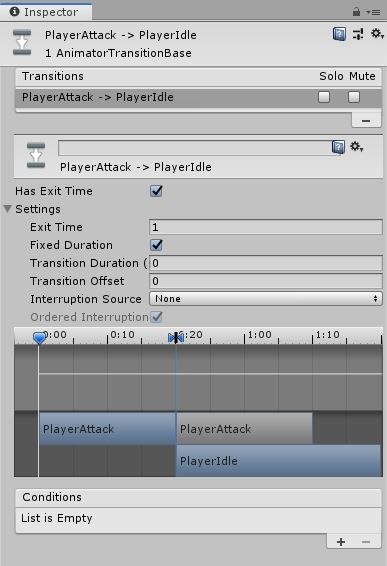

# Platformer

Here we will discuss how to make and use animations in Unity.

## Unity's Animation System

Unity has a **very** powerful [animation system](https://docs.unity3d.com/Manual/AnimationOverview.html). We could very easily get lost within this so we will have to focus down on a small part of it that we will start to use.

First let us talk about the type of animation we will be doing. Sprite based animations, or sprite sheet animation, think the original Super Mario. This is opposed to rigging based, think a Call Of Duty character.\
Sprite sheet animation is where we have basically a list of pics each defining a frame of the animation, or a pose. Checkout the image below :


You can see each frame is a distinct point in Mario's run animation. We can then put these one after another to create an animation for our character.

Unity's animation system is split into two main parts, [animations](https://docs.unity3d.com/Manual/AnimationClips.html) (also refered to as animation clips) and [animation controllers](https://docs.unity3d.com/Manual/AnimatorControllers.html). We will get more into this later. Let's start by creating a walking animation for our object.

### Splitting Sprite Sheets

For this project we will be using [this sprite sheet](Assets/SoliderSpriteSheet.png). Drag that into your sprites folder.\
The first thing we need to do is split up this sheet into individual sprites.\
Click on the image in your project and in the inspector change "Sprite Mode" from "Single" to "Multiple". Hit apply and then click "Sprite Editor".

Here we need to split up our sprite. At the top you will see a button that says split. When you click on it there will be a drop down. It should start with "Type" being set to "Automatic". Automatic is not always perfect but it will do for this right now.\
Hit slice and you should see your sprite split up by boxes around each frame of the animation.


When you head back to Unity you can click on the little arrow on the right of the sprite sheet and it will expand to show the newly split sprites.\
Awesome, we are now ready to put these together into animations.

### Animations

We are going to take a moment first to talk about what an animation is as Unity defines it a differently than what you might.\
An animation is not limited to just a changing our sprite. Animations are changing any value over time. Using the same animations we make our sprites in we can also set the players transform to go up, change the color of the sprite, or any other value on that object.\
We will stick to just sprites for right now though.\
This is the first part of Unity's animation system. The actual animation clip, or changing values of an object.

To start we need to replace the sprite from the [last lesson](./1%20PlayerController.md) with our new one.\
Do this by expanding the arrow on the side of the sprite in the folders and drag the very first one into the player's sprite in the inspector.\
Now this will mess up the colliders. You will need to adjust these **and** the ground check point. Once that's done you may have a object like this :


At first glance you may think we haven't covered the whole object but this isn't an issue. Anything that would hit, say the sword arm, will just pass through and end up hitting the body. No big deal.

Now we can begin the animation.\
At the top of Unity click on "Window", then scroll down to "Animation" and in the sub menu that pops out click "Animation". Place this window wherever.\
You will see that it is telling us we need to create an "Animation Clip". Go ahead an press create. You should place this in a new folder called "Animations". Name the animation "PlayerIdle".

Now when you go into the animation folder you will see two items have been created.


The one on the left, with the squares and lines, is not important right now. Do not delete it as we will be coming back to it later, for now just name it "PlayerAC".

#### The Animation Window

The item on the right, with the big play button, is what we want. This is our animation. Click on it and it should open in the Animation window.\
real quick click on the gear on the far right of the window and click "Show Sample Rate".\
You should have your window looking like this :


To start changing a property with the animation we need to press "Add Property". This is likely greyed out and this is because we need to have an object selected in the hierarchy in order to change one of it's properties.\
Click on the player object. Now you can press the "Add Property" button.\
A drop will come out listing every component on the object. Inside each of those is another list of (more or less) all the public values.

Since we want to change the sprite we should look under "Sprite Renderer" and find the "Sprite" property. Click the little plus icon beside it.\
You will now see the sprite listed in the animation. Let's break this down


*You can also click the drop down on the sprite to see a mini preview.*

On the left you will see controls for playing and pausing the animation. You should see the name of the animation you are editing, the sample rate (how many frames are in a second), and a few buttons to add points on the time line.\
Below that are the properties that are part of this animation. These are what we change.\
And on the right is the timeline. This shows what the properties should be at what points in the animation. These points are called "keyframes".

#### Animating Sprite Sheets

Now we can actually have the sprite change. Luckily since this is very common in Unity it does most of the work for us.\
Go into the sprites folder and expand the sprite sheet. Click on the first sprite there and then shift-click on the fourth. All four sprites will be selected.\
These four make up our idle animation. If you are wondering how we know this is is better visualized if you look at the [full sprite sheet](Assets/SoliderSpriteSheet.png). The first row contains the idle animation and it's four sprites long.

We've got a bit of a fib here. Remove the sprite property from the animation window by clicking the little icon on the right side of the property. We just wanted that for a visual to demonstrate adding a property by hand.\
With an empty animation and these four sprites selected, drag the sprites onto the animation window.


Unity has automatically added the sprite property and a key frame for each sprite. Awesome, that means we're done! Not quite, try hitting play on the animation window.\
Yeah unless he drank a few hundred cups of coffee that doesn't look like an idle stance.\
The problem is that Unity thinks there is sixty frames per second. Remember when we turned on "Show Sample Rate"? This is where that comes in handy. Just below the play buttons change sample rate to four. You can make this a little higher if you want it faster.

When you play the game you should see that your player moves around while playing the idle animation. If for some reason the player does not check that there is a "Animator" component added to the player (Unity should do this when you make the animation).\
If it's not, add an "Animator" component to the player and set the "Controller" to "PlayerAC" (which should be the only avaliable option). This should fix the problem for now.

Next we are going to setup the next two animations on our sheet in the same way.\
Start by making a new animation by clicking on the name right below the animation windows controls. This should have the name of the currently selected animation. Here click "Create New Clip" and name it "PlayerRun".\


*If the animation window seems to have greyed out buttons just make sure you have the player object selected in the hierarchy.*\
Make sure you place this in the animation folder. Now all we should need to do is select and drag the next eight sprites from the sheet into the animation. Set the sample rate to something appropriate.\
That should be good, the player should now be running in place.

Do the exact same thing with the next eight sprites and make the "PlayerAttack" animation. **Careful**, the very last sprite on the sheet is not part of that animation.\
You should now have three animations in your animation folder, "PlayerIdle", "PlayerRun", and "PlayerAttack". Go through and look at all of these in the animation window and make sure they are correct.

There is certainly some fine tuning we could do, particularly slicing sprites, but for the example it looks great.\
With that we can now get these hooked up to our game.

### Animation Controllers

Animation clips hold the information of what to change about our object, namely the sprite in our case. On their own they really don't do much, we need to be able to tell Unity when to play certain animations.\
This is where the other half of Unity's animation system comes in, the [Animator](https://docs.unity3d.com/Manual/AnimatorControllers.html) (or animation controller).

If you look in the animations folder you should see the icon with a play button and squares, earlier we named this "PlayerAC" which stands for "Player Animation Controller".

<p align="center">
	
</p>

Unity made this automatically as our animations will not work without one. Now we can use it to hook our animations together. Click on it and this screen should pop up :


What is this? This is, as the name implies, a controller for our animations on the player. In the right side of the window you will see a visual representation of our ["States"](https://docs.unity3d.com/Manual/StateMachineBasics.html). For our purposes each state is just an animation.\
We use this to transition between the different states, or, move between animations.

#### States

You can also see an arrow going from the "Entry" state to the "Idle" state. This is exactly what is mentioned above. Currently, when we play the game the idle animation is played. Because idle is hooked up to one of the special states. These are :

* Entry, this is where the controller starts. Think of the `Start` function.
* Any State, this actually represents any of the other states. If you have a transition coming off of this it can be called from any other state.
* Exit, tells the state machine to exit, meaning it no longer will do anything. We likely won't need this.

We have our states, animations, and transitions that move us between them. But we need to tell these transitions when they should transistion. We do this with parameters.

#### Parameters

There is a tab on the left side of this window that says ["Paremeters"](https://docs.unity3d.com/Manual/AnimationParameters.html). Click on that and you'll see that there is nothing there. Let's start by adding one for the idle state.\
We start by thinking of how the idle state works. Is idle a one time thing or can you be in it for a long time? Which states can you go to idle from?\
Well we could at anytime stop moving and become idle and we can be there for as long as we want.\
With that in mind click the plus sign off to the right of where it says "Parameters". A drop down list will come out with four options. To quote Unity themselves :

>*Integer* - a whole number
*Float* - a number with a fractional part
*Bool* - true or false value (represented by a checkbox)
*Trigger* - a boolean parameter that is reset by the controller when consumed by a transition (represented by a circle button)

`bool` fits our idle state the best. We can have it stay true as long as we want. Let's make a bool and name it "pIdle", for "Player Idle".


#### Transitions

Now we can set a transition to that. Which states should we be able to go to idle from? Likely any state so let's use the "Any State".\
To set this up we can right-click on the "Any State" state and hit "Make Transition". Then click on the "Idle" state to attach it. Now we have a transition from "Any State" to "Idle" and you can tell the direction because of the little arrow.\
Now this doesn't do anything as is, we still need to tell it when to do this transition.\

Click on the transition (not the state). In the Inspector there will will be quite a few options avaliable. The main one we need is at the bottom, "Conditions".\
Here we want to press the plus button. Unity will automatically fill this in and because there is only one parameter we should be good. It should have "pIdle" in the first box and "true" in the second.


Now when the condition is fufilled (`pIdle` being `true`) our object with transition from any state to the Idle state.\
Above the transition there is a drop down labeled "Settings". In here the last option is called "Can Transition To Self". Make sure this un checked. This prevents our state from being able to enter the same state.\
That is all we really need to do here but for best practice we need to change two other things about this transition in the inspector. We need to ensure "Has Exit Time" is **not** checked. In the little timeline below there are a few things on the scrub bar at the top. Find the blue arrow that is farthest to the right and drag it to the left. This makes it so there is no blending between our two animations here. This doesn't really happen with sprites but still, best practice.

There we go. We have a transition from any state to our Idle state whenever the `pIdle` variable is `true`. Still doesn't do anything exciting. For that we need to add the ability to transition to some other states.

We should make a transition to "PlayerRun" and to "PlayerAttack". Running should have a boolean because we want this animation playing whenever we are running. Create a new boolean and call it "pRun".\
We also can transition from any state to running so let's make a transition from "Any State" to "PlayerRun". Click on that state and add the condition for "pRun" being true. Make sure to un-tick "Can Transition To Self".\
You can do the same as before to the rest of the settings of this animation if you want.\

Last we have our "PlayerAttack" state. This one is a bit different.\
Firstly, our attack is a fixed duration so a bool won't be the best choice. We should create a "Trigger" for this animation as we want it to fire once when we attack. Do just that and name it "pAttack".\
Create a transition from "Any State" to "PlayerAttack" and give it the "pAttack" trigger as a condition. Give this transition all the same settings.\
There is an extra bit here though. After our attack we don't want to just continually attack, we need to transition back to another state. We could setup some nice logic to figure out which one to go back to but for these purposes let's just make a transition from "PlayerAttack" to "PlayerIdle".\
Click on the transition and this time we don't want any conditions and do want "Has Exit Time" checked. This means that the animation will transition using this transition after a certain amount of time. We will also have to set up the little timeline like this :



After all that our states should look something like this :


With that set up we can begin to hook up code to this in order to switch states during gameplay.

### Changing States With Code

Open up your player input script.\
First thing we need to do is get a reference to the animator on our player. Add this to the top of our script :

```csharp
public class PlayerInput : MonoBehaviour {

	public PlayerController pCont;
	public Animator animator;
```

Now all we have to do is call ["SetBool"](https://docs.unity3d.com/ScriptReference/Animator.SetBool.html) on that animator to set our parameters. This takes in a string for the name or the parameter and then a value for that parameter.

When is our player moving? They are moving when our "GetAxis" for the horizontal is zero. Let's setup a little logic statement in our `Update` function.

```csharp
float xDir = Input.GetAxis("Horizontal");

	if(xDir == 0) {
		// Not Moving
	} else {
		// Moving
	}

pCont.Move(xDir);
```

Now we can replace the comments with setting the proper parameters.

```csharp
if(xDir == 0) {
	animator.SetBool("pIdle", true);
} else {
	animator.SetBool("pRun", true);
}
```

Now if you try to play that you will see the character freak out. This is because when we move both our parameters are true and the animator can't figure out which state to be in.\
An easy solution is to set the other boolean to false within this if.

```csharp
if(xDir == 0) {
	animator.SetBool("pIdle", true);
	animator.SetBool("pRun", false);
} else {
	animator.SetBool("pRun", true);
	animator.SetBool("pIdle", false);
}
```

That should be good. Now when you run your player will move between being idle and running.\
Next we can setup the attack. We won't go over creating a physical attack here, just the animation.\
Lucky for us this shouldn't be too hard. Just detect when the key we want is pressed and then play the attack. It really doesn't matter which button you use, in this case the space bar is used for jumping so we've just stuck "j" in there.

```csharp
if(Input.GetKeyDown("j")) {
	animator.SetTrigger("pAttack");	
}
```

This uses ["SetTrigger"](https://docs.unity3d.com/ScriptReference/Animator.SetTrigger.html) because this parameter is a trigger.\
Now once again you may rush to start swinging your sword and find that your player does not play the animation. This is again because since the other parameters can still be true Unity does not know which to go to.\
This isn't quite working and we'll have to change the transitions around to fix it. The problem is that the frame after we trigger the attack either the idle or run will just take over again.\
The solution is to move our transitions to only use any state for the attack. You can figure out what parameters are needed to switch between the different states and set up your transitions to look like this (leave attack as it was) :


Now we can switch between idle and running. Whenever we hit the attack button we go into an attack before going back to idle.

Now we should be able to run around and swing our sword. It won't look perfect and that's mainly due to doing the quick and easy way to slice our sprite sheet, but for this lesson it's fine.

### Adding A Jump

The last thing we will add is a jumping animation.