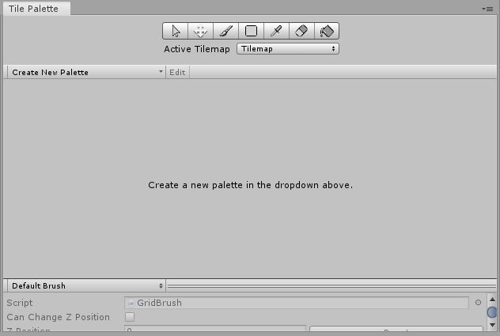
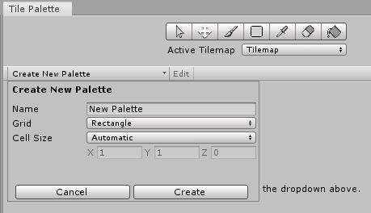
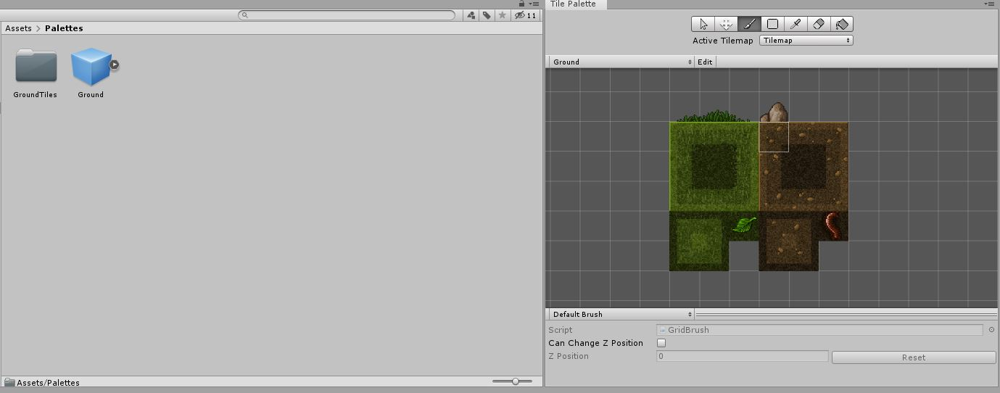
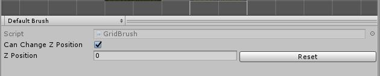
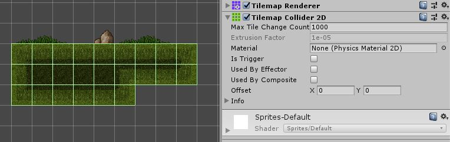

# Platformer

Here we discuss the tile editor in Unity.

## Tile Editor

Building our levels with stretched out boxes is great to start off with but gets boring pretty quick. It can also be very tedious to place each wall or bit of ground individually.\
This is where ["Tile Maps"](https://docs.unity3d.com/Manual/class-Tilemap.html) come in.\
Tile maps allow us to use a sheet, similar to a sprite sheet, to build levels with tiles. This is great for games like platformers as we can easily create navigable terrain.

### Tile Sets

Tile sets are groups of sprites made to line up like tiles and be easily expandable.
Start by downloading the [tile set](Assets/TileSet.png) included in this lesson and put it into your Unity project.\
First we need to change some settings on the sprite.

* Sprite Mode, this should be set to "Multiple".
* Pixels Per Unit, set to "32" because this is the size of our tiles.
* Filter Mode, This should be "Point (no filter)".
* Lastly, Compression, set to "None".

Now press apply and open the "Sprite Editor". At the top go to "Slice" then set "Type" to "Grid By Cell Size". Set the "Pixel Size" to `32` x `32`. Now you can hit "Slice" and then "Apply" in the top left.\
Now we should have a nicely sliced tile set.

## Tile Maps

Now we can start adding this map to Unity.\
Right-click on the hierarchy and under "2D Object" click on "Tilemap". This will create a "Grid" object with a "Tilemap" inside it.

Under the grid object you will see settings for the size of your grid. Usually it is best to leave these at the default but you can play with them if you want to.\
The tilemap is what will actually have our tiles on it. Once nice thing about this setup is that we can have multiple layers of tiles which is very convenient to create, say, a background layer.

### Palettes

Next we need to go to window at the top of the screen and under "2D" click "Tile Palette". This window will hold all the different tiles we can use.

First we need to create a new palette. On the left of the window there is a drop down menu labeled "Create New Palette", click on this to create a new palette.

Name this one something like "Ground". Create a new folder called "Palettes" to place this in.\
Now that we have a palette ready we can put our sprite into the palette.\
We actually don't want to select each individual sprite as this will import in the incorrect order. Instead, select the "parent sprite" (not the expanded view of the sliced sprites, the one that they expand out of).\
This will create a bunch of tile assets so we should make a folder inside the palettes folder and call it "GroundTiles".\
After that we should end with something similar to this :

This is all we need to start drawing into our scene.\
With the paint brush selected on the tile palette (<kbd>B</kbd>) you can draw tiles.\
In the preview of the palette you can drag and select all the different tiles you want to draw. You can also drag to select more than one at a time.\
You can erase tiles by selecting the eraser (<kbd>D</kbd>).\
Try playing around with the different tools available here.

If you wanted to create a new layer to your tile map, perhaps to have some tiles in front or behind of the others, you can simply right-click on the current grid object and create a new tile map.\
This will be created under the grid object that was created the first time. In order to have different layers you will need to create extra palettes. Then at the bottom of the palette window you can set the Z position for each palette, allowing some to be in front and other behind.

In this case if you wanted the rock and grass to be farther behind, as to not mess with the player, you could create a new palette, select those few sprites, drag them into the palette, and then set the Z index.\
Using multiple palettes is also useful if you wanted to separate different biomes or blocks into certain categories.

### Colliders

If you play the game right now your player will just fall right through the floor. This is due to us having no collider on the tile map.\
We don't want to use a normal collider though because we can use a ["Tilemap Collider 2D"](https://docs.unity3d.com/Manual/class-TilemapCollider2D.html).\
In the hierarchy we need to select the tile map object. Not the grid object, the child of it. Then add a component and search the for the tile map collider. That should do it.\
All the default settings for this should be fine.

Make sure you set the tile map layer to "GroundLayer" (or whichever layer you defined as the ground in your player controller) so the player can jump on it.

## On Your Own

Now you should be able to create a full platforming level. Try adding difficult jumps and gaps. Create a background and foliage for the level. Do what ever you want to create a visually interesting and fun scene.

You should also try to find some tile maps online that you can import into the game. Try finding some with trees and decorations or perhaps a new biome of ground.