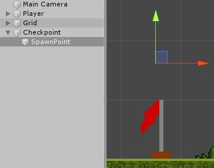
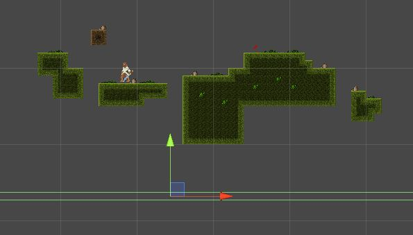

# Platformer

Here we will look over creating a basic checkpoint system for our game.

## Checkpoints

Let's go over what we want our checkpoints to do.

* Have a checkpoint object that our player can activate.
* When the player dies they should respawn at the last checkpoint they activated.
* This should be able to work with any number of checkpoints.

Alright, with that in mind we can set off!

### Creating The Object

To start we want to add a new sprite to our project. You can find a simple flag pole [here](Assets/FlagPole.png). You may of course use whatever you want but it should have two distinct states.\
Once that is in your project we need to adjust the settings for the sprite. It should be as follows :

* Sprite Mode, set to "Multiple".
* Filter Mode, set to "Point".
* Compression, set to "None".

We needed to set the Sprite Mode to multiple because there are actually two flags in our one image. A red and green flag.\
This also means we need to slice our sprite with the Sprite Editor. Luckily the automatic slicing should work in this case so just open up the editor and hit slice.

Now we can setup the object. Start by dragging the red flag into the scene. Rename it to "Checkpoint".\
We also want to give it a box collider and mark it as a trigger.\
That's most of it. Time to create a custom script to handle this. Create and name a new script "Checkpoint".

### Changing The Sprite

Let's start with declaring four variables.

```csharp
public class Checkpoint : MonoBehaviour {

	public Transform spawnAt;
	public Sprite inactiveSprite;
	public Sprite activeSprite;

	bool active = false;

}
```

The first one, `spawnAt`, is going to be where we want to spawn the player. This might not be right on the flag so having this allows us to just place them nearby.\
The inactive and active sprite should be fairly self explanatory.\
Lastly, the boolean `active` is just going to give us an easy way to tell if the checkpoint has been activated.

Next we need to handle collisions. Add in the function `OnTriggerEnter2D`.\
We will inside here we want to check if we collided with the player. We can use tags just like we have before (Here "col" is short for "collider").

```csharp
void OnTriggerEnter2D(Collider2D col) {

	if(col.tag == "Player") {
		
	}

}
```

Of course this means we need have the player tagged properly.\
Place a `Debug.Log` within the if statement and double check it is working.

If we are not currently active we need to switch over. Let's start with the sprite.\
We access the sprite with through the ["Sprite Renderer"](https://docs.unity3d.com/ScriptReference/SpriteRenderer.html) as you can see from looking at the components. We want to do just that. Add the following code :

```csharp
void OnTriggerEnter2D(Collider2D col) {

	if(col.tag == "Player" && !active) {
		active = true;
		GetComponent<SpriteRenderer>().sprite = activeSprite;
	}

}
```

What we are doing here is first checking if we are not active. Then we use ["GetComponent"](https://docs.unity3d.com/ScriptReference/Component.GetComponent.html) to get the SpriteRender from our game object. We set the sprite variable to the active sprite and this updates it in game.

Head back to the game and make sure you set the sprite variables correctly on the script.\
When you collide with the flag pole it should change from red to green. Great, that's step one done.

### Setting The Spawn Point

Time to make use of that `spawnAt` variable we made.\
Go onto the flag pole and create an empty object as a child. Then position this empty object to where you want the player to spawn at. The main reason we need this is to ensure we don't spawn in the ground so a simple thing is to just drag this object up a little.



Drag that into the variable `spawnAt` on the checkpoint.\
Now we need to actually spawn at that position when we die. We need a quick way to kil the player. You could bring in the [health scripts](../3%20Top%20Down%20Arcade/PlayerHealth.cs) from the [previous unit](../3%20Top%20Down%20Arcade/) but in this case we will cheat a bit since setting up enemies will take some time.\
Instead create a new object and give it a box collider. Make the collider really wide (using the size setting on the Box Collider 2D) and a trigger. Then place this below our world. We will use this to detect if our player fell off the map.



Make a temporary "PlayerHealth" script. Add in the `OnTriggerEnter2D` function.\
Add the following code to it :

```csharp
void OnTriggerEnter2D(Collider2D col) {

	if(col.tag == "BottomOfMap") {	
		Die();
	}

}
```

Make sure to create and add that tag to the bottom collider.\
Now to quickly make the `Die` function.

```csharp
void Die() {

	transform.position = spawnPosition;

}
```

Last thing is to add in the `spawnPosition` variable. This will be a `Vector3`. We will also need set a default for this in case we never hit a checkpoint.\
That'll look like this :

```csharp
public Transform spawnPosition;

void Start() {
	spawnPosition = transform.position;
}
```

This is very simplistic because we aren't trying to build a health script right now. Still, this should accomplish what we want. If you walk off the edge you should be teleported back to where you started. We want to focus on the check points.

Go back to the checkpoint script and now we can make this functional.\
We just need to add two lines of code to the `OnTriggerEnter2D` function.

```csharp
void OnTriggerEnter2D(Collider2D col) {

	if(col.tag == "Player" && !active) {

		active = true;
		GetComponent<SpriteRenderer>().sprite = activeSprite;

		PlayerHealth pHealth = col.gameObject.GetComponent<PlayerHealth>();
		pHealth.spawnPosition = spawnAt.position;

	}

}
```

In the first new line we create a variable that has the type of `PlayerHealth`. This is then set equal to the `PlayerHealth` script that is on our player. We need to use `GetComponent` because the script is a component of the game object.\
Then using this variable we can set the `spawnPosition` variable to the position we declared in the collider.\
Now we should be able to run into the checkpoint, die, and spawn back at the checkpoint.

We will likely need more than one checkpoint so you should turn this one into a prefab. Just drag it from the hierarchy into a new folder called "Prefabs".\
You can now add as many of these checkpoints as you want to the game. Try it out!

### Managing Multiple Checkpoints

As of now a checkpoint can only be activated once. This is fine if your game was linear and you'd just hit these checkpoints one after another.\
Now if you wanted a more free form approach we would have to make some changes. Let's do that now.

Here we only want one active checkpoint at a time. We also want to be able to access checkpoints multiple times.\
We are going to fix this by keeping a link to the last checkpoint and turning it off after we reach a new one. We are going to use a technique that we used when making our data manager script.

Open up the check point script.\
At the top let's add a new ["static"](https://docs.microsoft.com/en-us/dotnet/csharp/language-reference/keywords/static) variable for the active checkpoint. Remember for our purposes, static means that the variable is "always there".

```csharp
public class Checkpoint : MonoBehaviour {

	public Transform spawnAt;
	public Sprite inactiveSprite;
	public Sprite activeSprite;

	bool active = false;

	public static GameObject activeCheckpoint;
```

Here we can now store the last avaliable checkpoint.\
When we hit a checkpoint we now need to disable the last checkpoint and set the new checkpoint.\
Head over to your `OnTriggerEnter2D` function. Let's start by disabling our last checkpoint. This means we need to change the sprite to the inactive sprite and the set the `active` bool back to false.

```csharp
void OnTriggerEnter2D(Collider2D col) {

	if(col.tag == "Player" && !active) {

		// Set this checkpoint as active
		active = true;
		GetComponent<SpriteRenderer>().sprite = activeSprite;

		// Set the player's checkpoint
		PlayerHealth pHealth = col.gameObject.GetComponent<PlayerHealth>();
		pHealth.spawnPosition = spawnAt.position;

		// Deactivate the last checkpoint
		activeCheckPoint.GetComponent<Checkpoint>().active = false;
		activeCheckPoint.GetComponent<SpriteRenderer>().sprite = inactiveSprite;

		// Change the active checkpoint variable
		activeCheckpoint = gameObject;

	}

}
```

We've only really added those three last lines.\
Those lines take the last checkpoint and set the sprite and `active` bool. Then lastly we make the checkpoint that was hit the new active checkpoint.

If we play our game now the checkpoints should all update appropriately. That's all great!\
There is a problem introduced here. Since our `activeCheckpoint` variable does not start with a value we can create an error by starting the game and walk off the ledge before activating any checkpoints.\
We can solve this fairly easily. We just need to check if `activeCheckpoint` is null before we try to access it.

```csharp
if(activeCheckPoint != null) {
	// Deactivate the last checkpoint
	activeCheckPoint.GetComponent<Checkpoint>().active = false;
	activeCheckPoint.GetComponent<SpriteRenderer>().sprite = inactiveSprite;
}
```

That will supress the error.\
It's important to note that we only want to encapsulate these two lines with the `if` statement.\
Whether or not if there is currently an active checkpoint we want to set the checkpoint we just hit to the active one. Otherwise we would never be able to set the next checkpoint.

This should be all you need to have a working checkpoint system. If your checkpoint prefab is all update you should be able to drag in checkpoints and they will work right out of the box.

### Optimizing Checkpoints

If you feel extra code happy today we will go over some tips to improve our code and make it faster.\
One method we have made rather liberal use of here is the `GetComponent` method. For what we are doing this will be just fine, but is good for us to know that this method is heavy.\
What we mean by that is simply that it takes a lot of processing power compared to something like adding.

At this point you are unlikely to be noticing any preformance issues but as a game grows, using `GetComponent` can start to wear down on it.\
Let's improve our script to be more stream lined.

To start we will look at our code.

```csharp
void OnTriggerEnter2D(Collider2D col) {

	if(col.tag == "Player" && !active) {

		// Set this checkpoint as active
		active = true;
		GetComponent<SpriteRenderer>().sprite = activeSprite;

		// Set the player's checkpoint
		PlayerHealth pHealth = col.gameObject.GetComponent<PlayerHealth>();
		pHealth.spawnPosition = spawnAt.position;

		// Deactivate the last checkpoint
		activeCheckPoint.GetComponent<Checkpoint>().active = false;
		activeCheckPoint.GetComponent<SpriteRenderer>().sprite = inactiveSprite;

		// Change the active checkpoint variable
		activeCheckpoint = gameObject;

	}

}
```

As you can see we make four calls with `GetComponent`. One to the `SpriteRenderer` on the checkpoint on this script. One to `PlayerHealth` on the player. Then two more to the `SpriteRenderer` of the last checkpoint and the actual `Checkpoint` script of it.\
We can get this down to just one call.\
This script is on a checkpoint. That checkpoint will always have our renderer so we can make it a reference.\
We do this just by adding a `public SpriteRenderer` to the script.

```csharp
public class Checkpoint : MonoBehaviour {

	public Transform spawnAt;
	public Sprite inactiveSprite;
	public Sprite activeSprite;

	public SpriteRenderer renderer;

	bool active = false;

	public static GameObject activeCheckpoint;
```

Now we can use that in place of the `GetComponent` call. Of course before you play the scene you need to drag the SpriteRenderer from the inspector into the variable's spot.

```csharp
void OnTriggerEnter2D(Collider2D col) {

	if(col.tag == "Player" && !active) {

		// Set this checkpoint as active
		active = true;
		renderer.sprite = activeSprite;

		// Omitted for brevity

	}

}
```

One down.\
The sharp eye may already notice where the next comes from.\
If `renderer` is now a variable on `Checkpoint` that means we can use it on every `Checkpoint` script.\
That means when we get the `Checkpoint` of the last checkpoint we should store it to a variable before we use it to set the `active` variable. Then we can access it twice.

```csharp
void OnTriggerEnter2D(Collider2D col) {

	if(col.tag == "Player" && !active) {

		// Omitted for brevity

		// Deactivate the last checkpoint
		Checkpoint lastCheckpoint = activeCheckPoint.GetComponent<Checkpoint>();
		lastCheckpoint.active = false;
		lastCheckpoint.renderer.sprite = inactiveSprite;

		// Change the active checkpoint variable
		activeCheckpoint = gameObject;

	}

}
```

There we go, that should be down to just two.\
We cannot get rid of the `GetComponent` for the player's health (without making our code messy) so we'll have to get rid of this last call for `Checkpoint`.

The secret here is in the `lastCheckpoint` variable. Currently this a `GameObject`. We had this because we needed to get both the `Checkpoint` and `SpriteRenderer`. Now that the renderer is actually on the `Checkpoint` script we can replace this `GameObject` variable with a `Checkpoint`.

```csharp
public static Checkpoint activeCheckPoint;
```

Now we no longer need to use `GetComponent` for that variable. So this :

```csharp
Checkpoint lastCheckpoint = activeCheckPoint.GetComponent<Checkpoint>();
lastCheckpoint.active = false;
lastCheckpoint.renderer.sprite = inactiveSprite;
```

Becomes :

```csharp
activeCheckPoint.active = false;
activeCheckPoint.renderer.sprite = inactiveSprite;
```

We can't forget though that we have to set the `activeCheckpoint` to the checkpoint that was just hit.\
At the end of the `OnTriggerEnter2D` do this :

```csharp
// Change the active checkpoint variable
activeCheckpoint = this;
```

You might not have seen this before (that was an intential pun).\
`this` refers to the current class your code is in. In our case this is the `Checkpoint` script.\
Since `this` refers to the instance of the class, it doesn't matter which checkpoint we hit, the `activeCheckpoint` will be set to the checkpoint we just hit.

That should be it. Now our code is optimized!\
Again, this likely wasn't necessary as the game was not lagging but the skill of identifying and improving our code is essential to progress.\
It also simply helps build good habits.