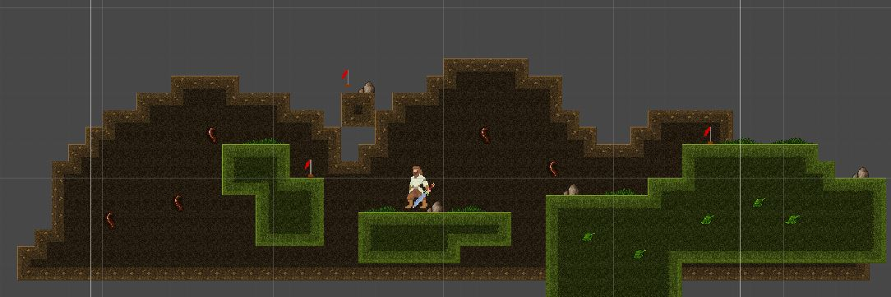
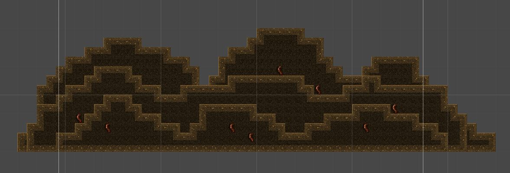

# Platformer

Here we will create a script that simulates the parallax effect.

## Parallax

First off, what is parallax?\
Well according to [Wikipedia](https://en.wikipedia.org/wiki/Parallax_scrolling) the parallax effect (in the article it's called parallax scrolling) is :

> A technique in computer graphics where background images move past the camera more slowly than foreground images, creating an illusion of depth in a 2D scene and adding to the sense of immersion in the virtual experience.

To put it another way. We want to make our background look like it's actually far away.\
The main way to achieve this is to make that background move slowly.\
This creates the same effect as looking into the distance on a car trip. The trees near the side of the road race by while the mountains in the distance seemingly move across your vision much slower.

This is purely asethetic for our game but if you use it correctly it is a really going to make your game look better. Let's set off to create this.

### Creating A Background

Of course we need to have a background before we can move it. We can quickly do this with our [Tile Editor](./3%20TileEditor.md) which we used a few lessons ago.\
To start create a new "Tilemap" object where we will put our background. This must be on a seperate object from our previous maps. Then we just need to make something pretty to be in our background. In this case we'll do some mountains but feel free to do you own thing.\



Of course we don't need to use a Tilemap to do this, in the future it could just be a sprite. Since we've just learned about this great tool that is the Tile Editor we will be using it here.\
To demonstrate our effect better we should add a few more layers to this. Create another "Tilemap" object and create a slightly closer and smaller background. In the case of mountains, we'd now be making hills.\
Repeat this process one more time so that we have three layers of our background. This will make the parallax effect look much better than with a single layer.



*Note*\
Make sure you position the `z` of these objects so that the smallest is in the front.

With those ready we can begin to write some code to simulate the parallax effect.

### Tracking An Object

One of the main parts of parallax is that it has to do with moving objects. This means we need to track an object and move based on it.

Of course we must start with creating a script for this. We should call it "Parallax". Open that up.\
First we need that object to track. You may jump straight to the player but this isn't what we want to do.\
Sinze parallax is purely a visual effect we actually want to track the camera. It's possible that your camera does not match your player's movement exactly (like if you are using the camera script from the [last unit](../3%20Top%20Down%20Arcade/Library/CameraFollow.cs)).\
The method is still the same, add a public `Transform` to the top of our script. Let's also add a comment reminding us to use the camera also.

```csharp
public class Parallax : Monobehaviour {

	// Make sure to track the camera
	public Transform objectToFollow;

}
```

Now our object should move based on the player. But it should actually be opposite of the player. That makes it a little bit different.\
First we will store our current position to a variable so we can edit it. Then we change the `x` direction to the *negative* of the object we are following's `x` position.\
Then we set our position back to our position variable. That should look like this :

```csharp
void Update() {

	Vector3 nextPosition = transform.position;
	nextPosition.x = -objectToFollow.position.x;

	transform.position = nextPosition;

}
```

Now if you go back to your game and attach this to the furthest back backgroud object. You will see this now move opposite to the player. This is most of the way to what we want.\
Next thing is to make this move at a slower speed.\
This can be acheived with a simple multiplication. Add a public `float` called "relativeSpeed" and then multiply our x position by that.

```csharp
public float relativeSpeed;

void Update() {

	Vector3 nextPosition = transform.position;
	nextPosition.x = -objectToFollow.position.x * relativeSpeed;

	transform.position = nextPosition;

}
```

Now in the editor set that variable to something between `0` and `1`. The object will now appear to move as if it is very far in the background.

#### Multiple Layers

After we've got that working on one of the layers in our background it is time to get it working with all three layers we created.\
To start, each layer will be moving at a different speed. This is just like looking out a car window. The trees seem to move very fast where as the mountains, further away, appear to be very slow.\
Add the script to each layer of the background and set the relative speed so the the backgrounds have three unique values with the closest background object's value being the closest to `1`.\
After setting each of these to track the camera you should be able to play the game and see our backgrounds nicely moving at a relative speeds to their distance from the player.

### Repeating Backgrounds

**Caution**\
This section is going to be more complex than what we have already done. We encourage you too try going through this but if it feels too complex do not worry, you are free to move on to the [next section](#on-your-own).

What you may notice if your levels are very long or background is very small is that the parallax will reveal the edge of the sprite.\
This obviously looks really bad and we need to fix it. The easiest solution is to get a bigger background or simply increase the scale of this image.\
While this could work it probably is not the best looking thing now and technically you could reach the end of the background.\
To fix this issue we need to tile our background.

The goal here is that when our player reaches the edge of the background we create a new background tile so that it appears to be unending.\
There are quite a few moving parts to this operation so let's just get started.

#### Setting Up Tiles

Now for this technique to work we need to make sure that one "section" of our background can fill the entire screen, as in you can't see either edge. We also need the edges to link up to each other so they can be repeated.\
If you are using the tile editor this should be fairly simple we just need to make both edges of the background line up at the same height.\
If you are using a sprite as the background that might be a little harder. Unless the background is made to be tiled it will have an obvious break in it.

For the method outlined here we will always have three copys of the background. There is one that the player is in line with and then one in front and behind it that.\
When making these three objects we need to first put them in an empty object. This is great for organization and will help with our script.

// Img needed

This holder object is the one you should now put the parallax script on.\
It should look something like this :

// Img needed

*Note*\
To make our scene more simple we've disabled the other backgrounds.

Now that we have that set up let's talk about how we are going to create the illusion of an infinite background.\
The idea is that we always want the player to be in the middle of these three tiles. We can't simply move them along with the player as that would ruin the parallax effect we've just made.\
When the player gets to the edge of the "middle" tile we want to move the tile on the end to be in front of the player. That looks something like this :

// Drawing needed

There is a lot to this so we are going to break this down into a few parts.

#### Detecting Player Position

The first thing we need to do to accomplish the goal here is to figure out which tile our player is over.\
Make a new script and put it onto the holder for our background tiles. Let's call it "TileManager". For the rest of this section we will be referring to this pieces of background as tiles.

In our script we need to have a reference to each one of these objects. Add these as `public GameObject` variables.

```csharp
public class TileManager : Monobehaviour {

	public GameObject leftTile;
	public GameObject middleTile;
	public GameObject rightTile;

}
```

These will be set according to their names.\
Of course, we also need to track the player's position. add a `public Transform player` to the script. We want this to be a Transform as all we will need is the player's position and not other components.

What we want to do here is decide if the player is over the left, middle, or right tile so we need to know how big a tile is.\
In order to do this we must know how big the tile is. We of course could guess at this or if we used the tile editor to make your background piece we could count the tiles.\
While either of these work they really are not ideal. We can fix this with two lines of code.

```csharp
private float size;

void Start() {
	size = middleTile.GetComponent<Renderer>().bounds.size.x;
}
```

What is going on here? We are storing a float the length of one tile. We get this value from the size of the renderer that is showing us the tile.\
Because this value will not change we only need to put this code into the `Start` function.\
If you'd like a little more detail, try looking this up in the [documentation](https://docs.unity3d.com/ScriptReference/Renderer.html).

With this we can begin to find out where the player is in relation to tiles. This will require a little bit of math. We all love math right?

To start we are going to add the following to our `Update` function for convenience.

```csharp
void Update() {

	float playerX = player.position.x;
	float middleTileX = middleTile.transform.position.x;

}
```

These are both here just to make it easier to write the rest of the code.\
Next thing we need to do is find out the left and right bound of the middle tile. What that means is we need to know the left most and right most point on the tile. Like so :

// drawing needed

With a little bit of math we can see that to get the left most position of the tile we need to go from the middle (the X position) to the left by half of the size. The right is the same.\
Let's add these as variables :

```csharp
void Update() {

	float playerX = player.position.x;
	float middleTileX = middleTile.transform.position.x;

	float leftBound = middleTileX - size / 2;
	float rightBound = middleTileX + size / 2;

}
```

Now we have everything we need to figure out where the player is.\
Let's add some logging to see if this is working correctly. In the `Update` function add this :

```csharp
if(playerX < leftBound) {

	// The player is over the left tile
	Debug.Log("Left");

} else if(playerX > rightBound) {

	// The player is over the right tile
	Debug.Log("Right");

} else {

	// The player is in the middle
	Debug.Log("Middle");

}
```

Now when we play our game we should be able to see in the console which tile we are over top.\
If your tiles are very large you may want to try out moving your player in the scene view while the game is running. That way you can verify if this is working without running to the ends of the world.\
Another tip, to easily identify your tiles, color the left and right tiles two different colors using the `SpriteRenderer` component on them.

Once our player position is detected properly we can move onto sorting the positions of our tiles.

#### Sorting Positions

Knowing the position of our player allows the next step of this process to be completed.\
We wanted to make sure the tile our player is over is always the middle tile, this means we need to switch around which tile is set as the middle tile.

Let's start with the left side.\
When the player moves onto the left tile we need to "shift" our tiles around like so :

// Drawing needed

As you can see, the left becomes the middle, the middle becomes the right, and the right becomes the left. To do this we simply need to swap around the values of our three tiles.

```csharp
if(playerX < leftBound) {

	// The player is over the left tile
	middleTile = leftTile;
	rightTile = middleTile;
	leftTile = rightTile;

}
```

Wait a minute, do you see the problem here?\
If we set the value of the middle tile, we've entirely lost the original value of the middle tile. This means setting the right tile will not work.\
Let's use a temporary variable and change the order to solve this problem.

```csharp
if(playerX < leftBound) {

	// The player is over the left tile
	GameObject tempTile = leftTile;
	leftTile = rightTile;
	rightTile = middleTile;
	middleTile = tempTile;

}
```

By changing the order and using one temporary variable we are able to succesfully swap these tiles around.

Now the right side is very similar just in a different order.

// Drawing needed

In this case, the right becomes the middle, the middle becomes the left, and the left becomes the right.

```csharp
if(playerX > rightBound) {

	// The player is over the right tile
	GameObject tempTile = leftTile;
	leftTile = middleTile;
	middleTile = rightTile;
	rightTile = tempTile;

}
```

That should do it!\
You'll see that we actually don't need anything to happen if we are over the middle tile. This makes sense because if we are over the middle tile then the tiles are in the position we want them in.

Next we just need to start moving the tiles into the correct positions.

#### Moving The Tiles

// In Progress

## On Your Own

Here we have parallax working in the X dimension. The thing is, parallax also applies to the Y dimension. We won't go over that here though. But if your platformer will have a lot of verticality you may want to implement this.\
The method for this will be almost the exact same so go ahead and try it out!

Another great thing to note is that by setting the relative speed of an object above `1` the object will appear to zoom by faster than the player is moving.\
We can use this to make things appear closer to the camera than the player. For instance, if your player was supposed to be really fast you might want to have some trees that zoom past in front of the player. This can really enhance the look of the game, just make sure they don't block the camera.
